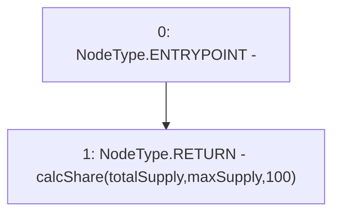

# Context: Utils.getFeeOnTransfer

**Contract:** `Utils` (Inherits: None)
**Signature:** `getFeeOnTransfer(uint256,uint256) returns (uint256)`
**Method Selector ID:** `0x8b18b115`
**Visibility:** `external`
**Environment-Free:** `Yes`
**Modifiers:** None

### State Variables Interaction
- **Reads:** None
- **Writes:** None

### Environment & Verification Flags
- **Uses Foundry Cheatcodes:** No
- **Has Echidna Properties:** No

### Internal Calls Tree
- None

### External Calls / Value Transfers
- None

### Control Flow Graph (CFG)


### Source Mapping
Declared in: `contracts/Utils.sol` on lines **41** to **43**

```solidity
    function getFeeOnTransfer(uint totalSupply, uint maxSupply) external pure returns(uint){
        return calcShare(totalSupply, maxSupply, 100); // 0->100BP
    }

```
