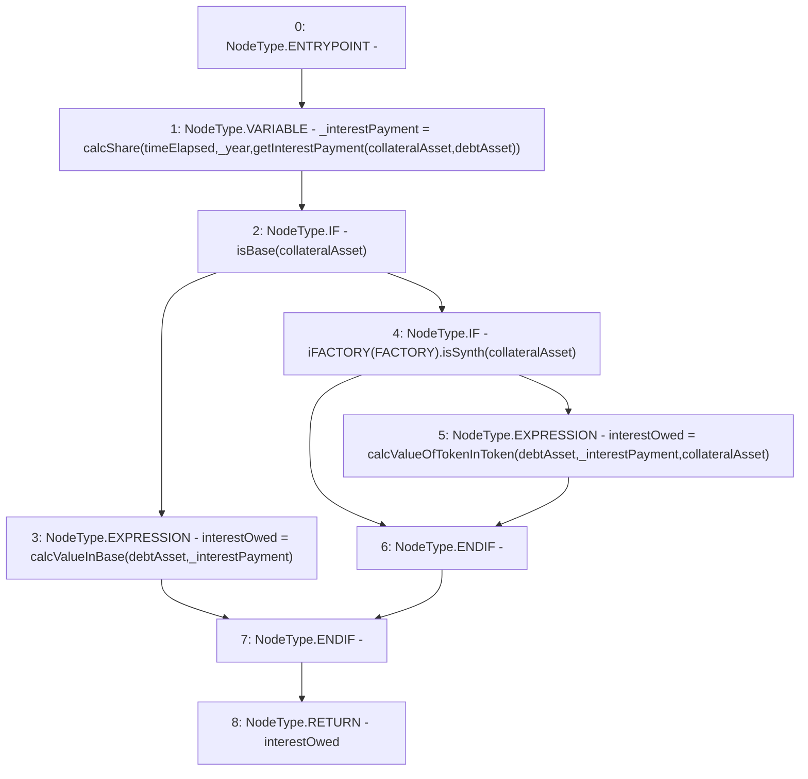

# Context: Utils.getInterestOwed

**Contract:** `Utils` (Inherits: None)
**Signature:** `getInterestOwed(address,address,uint256) returns (uint256)`
**Method Selector ID:** `0x945821af`
**Visibility:** `external`
**Environment-Free:** `Yes`
**Modifiers:** None

### State Variables Interaction
- **Reads:** FACTORY, _year
- **Writes:** None

### Environment & Verification Flags
- **Uses Foundry Cheatcodes:** No
- **Has Echidna Properties:** No

### Internal Calls Tree
- None

### External Calls / Value Transfers
- `iFACTORY.TMP_995(bool) = HIGH_LEVEL_CALL, dest:TMP_994(iFACTORY), function:isSynth, arguments:['collateralAsset']  `

### Control Flow Graph (CFG)


### Source Mapping
Declared in: `contracts/Utils.sol` on lines **175** to **182**

```solidity
    function getInterestOwed(address collateralAsset, address debtAsset, uint timeElapsed) external view returns(uint interestOwed) {
        uint _interestPayment = calcShare(timeElapsed, _year, getInterestPayment(collateralAsset, debtAsset)); // Share of the payment over 1 year
        if(isBase(collateralAsset)){
            interestOwed = calcValueInBase(debtAsset, _interestPayment); // Back to base
        } else if(iFACTORY(FACTORY).isSynth(collateralAsset)) {
            interestOwed = calcValueOfTokenInToken(debtAsset, _interestPayment, collateralAsset); // Get value of Synth in debtAsset (doubleSwap)
        }
    }

```
