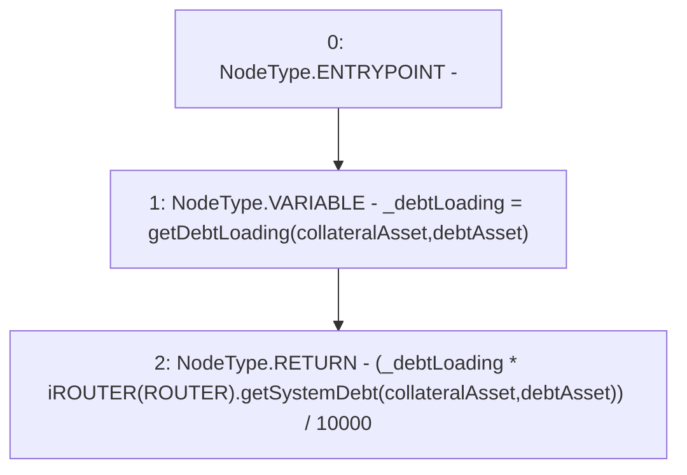

# Context: Utils.getInterestPayment

**Contract:** `Utils` (Inherits: None)
**Signature:** `getInterestPayment(address,address) returns (uint256)`
**Method Selector ID:** `0xc2886b8a`
**Visibility:** `public`
**Environment-Free:** `Yes`
**Modifiers:** None

### State Variables Interaction
- **Reads:** ROUTER
- **Writes:** None

### Environment & Verification Flags
- **Uses Foundry Cheatcodes:** No
- **Has Echidna Properties:** No

### Internal Calls Tree
- None

### External Calls / Value Transfers
- `iROUTER.TMP_999(uint256) = HIGH_LEVEL_CALL, dest:TMP_998(iROUTER), function:getSystemDebt, arguments:['collateralAsset', 'debtAsset']  `

### Control Flow Graph (CFG)


### Source Mapping
Declared in: `contracts/Utils.sol` on lines **183** to **186**

```solidity
    function getInterestPayment(address collateralAsset, address debtAsset) public view returns(uint) {
        uint _debtLoading = getDebtLoading(collateralAsset, debtAsset);
        return (_debtLoading * iROUTER(ROUTER).getSystemDebt(collateralAsset, debtAsset)) / 10000; 
    }

```
