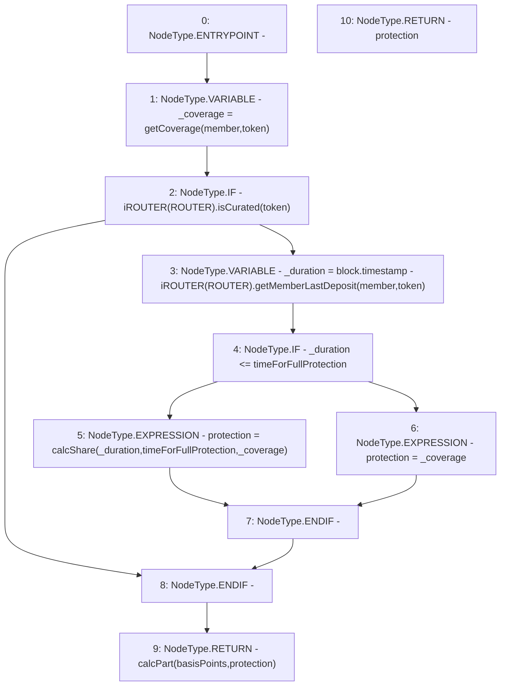

# Context: Utils.getProtection

**Contract:** `Utils` (Inherits: None)
**Signature:** `getProtection(address,address,uint256,uint256) returns (uint256)`
**Method Selector ID:** `0x5b0b602d`
**Visibility:** `public`
**Environment-Free:** `No (reads EVM state context)`
**Modifiers:** None

### State Variables Interaction
- **Reads:** ROUTER
- **Writes:** None

### Environment & Verification Flags
- **Uses Foundry Cheatcodes:** No
- **Has Echidna Properties:** No

### Internal Calls Tree
- None

### External Calls / Value Transfers
- `iROUTER.TMP_943(uint256) = HIGH_LEVEL_CALL, dest:TMP_942(iROUTER), function:getMemberLastDeposit, arguments:['member', 'token']  `
- `iROUTER.TMP_941(bool) = HIGH_LEVEL_CALL, dest:TMP_940(iROUTER), function:isCurated, arguments:['token']  `

### Control Flow Graph (CFG)


### Source Mapping
Declared in: `contracts/Utils.sol` on lines **129** to **140**

```solidity
    function getProtection(address member, address token, uint basisPoints, uint timeForFullProtection) public view returns(uint protection) {
        uint _coverage = getCoverage(member, token);
        if(iROUTER(ROUTER).isCurated(token)){
            uint _duration = block.timestamp - iROUTER(ROUTER).getMemberLastDeposit(member, token);
            if(_duration <= timeForFullProtection) {
                protection = calcShare(_duration, timeForFullProtection, _coverage); // Apply 100 day rule
            } else {
                protection = _coverage;
            }
        }
        return calcPart(basisPoints, protection);
    }

```
