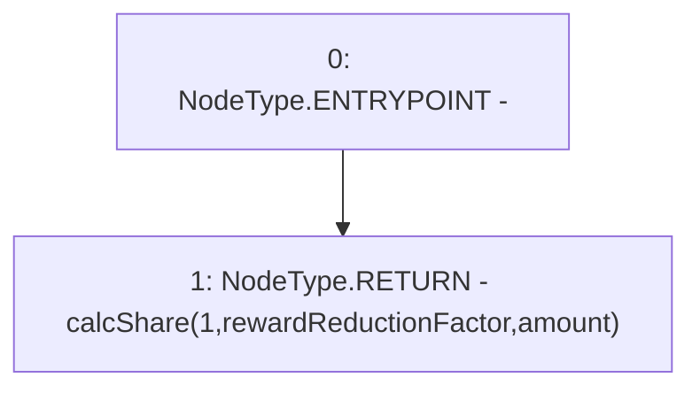

# Context: Utils.getReducedShare

**Contract:** `Utils` (Inherits: None)
**Signature:** `getReducedShare(uint256,uint256) returns (uint256)`
**Method Selector ID:** `0xbd2bdaf2`
**Visibility:** `public`
**Environment-Free:** `Yes`
**Modifiers:** None

### State Variables Interaction
- **Reads:** None
- **Writes:** None

### Environment & Verification Flags
- **Uses Foundry Cheatcodes:** No
- **Has Echidna Properties:** No

### Internal Calls Tree
- None

### External Calls / Value Transfers
- None

### Control Flow Graph (CFG)


### Source Mapping
Declared in: `contracts/Utils.sol` on lines **122** to **124**

```solidity
    function getReducedShare(uint amount, uint rewardReductionFactor) public pure returns(uint) {
        return calcShare(1, rewardReductionFactor, amount); // Reduce to stop depleting fast
    }

```
