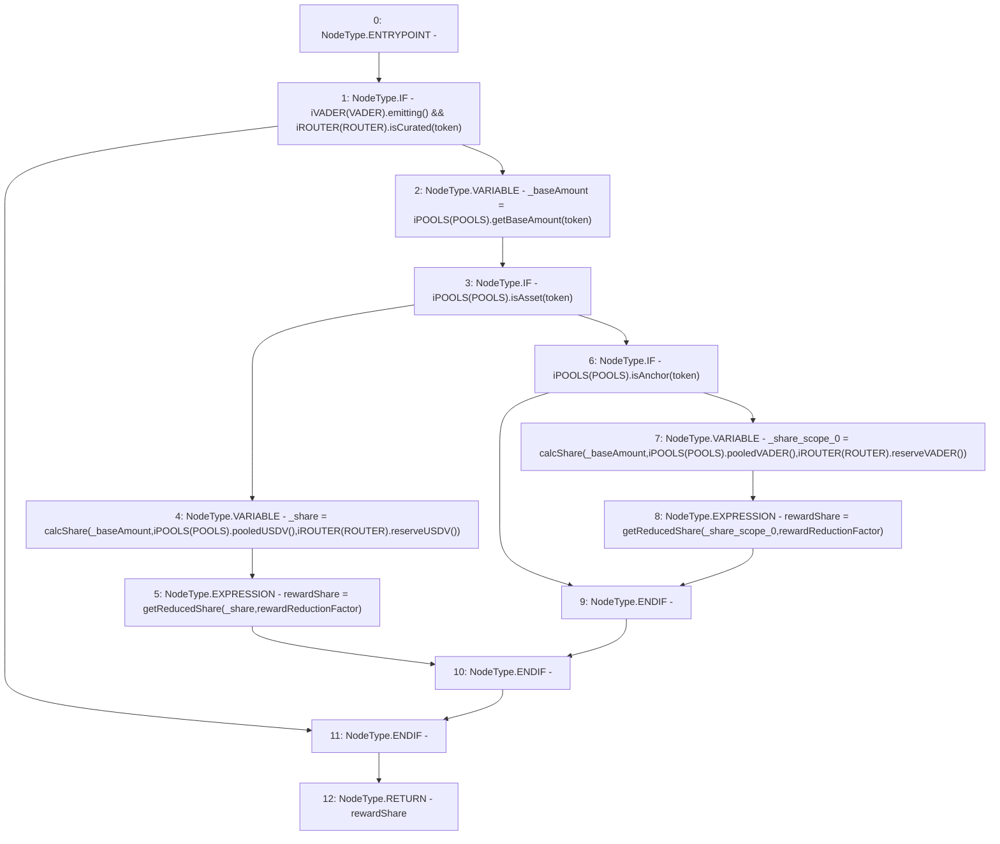

# Context: Utils.getRewardShare

**Contract:** `Utils` (Inherits: None)
**Signature:** `getRewardShare(address,uint256) returns (uint256)`
**Method Selector ID:** `0xb4951e4a`
**Visibility:** `external`
**Environment-Free:** `Yes`
**Modifiers:** None

### State Variables Interaction
- **Reads:** POOLS, ROUTER, VADER
- **Writes:** None

### Environment & Verification Flags
- **Uses Foundry Cheatcodes:** No
- **Has Echidna Properties:** No

### Internal Calls Tree
- None

### External Calls / Value Transfers
- `iPOOLS.TMP_925(uint256) = HIGH_LEVEL_CALL, dest:TMP_924(iPOOLS), function:pooledUSDV, arguments:[]  `
- `iPOOLS.TMP_921(uint256) = HIGH_LEVEL_CALL, dest:TMP_920(iPOOLS), function:getBaseAmount, arguments:['token']  `
- `iPOOLS.TMP_931(bool) = HIGH_LEVEL_CALL, dest:TMP_930(iPOOLS), function:isAnchor, arguments:['token']  `
- `iPOOLS.TMP_933(uint256) = HIGH_LEVEL_CALL, dest:TMP_932(iPOOLS), function:pooledVADER, arguments:[]  `
- `iROUTER.TMP_918(bool) = HIGH_LEVEL_CALL, dest:TMP_917(iROUTER), function:isCurated, arguments:['token']  `
- `iROUTER.TMP_927(uint256) = HIGH_LEVEL_CALL, dest:TMP_926(iROUTER), function:reserveUSDV, arguments:[]  `
- `iVADER.TMP_916(bool) = HIGH_LEVEL_CALL, dest:TMP_915(iVADER), function:emitting, arguments:[]  `
- `iROUTER.TMP_935(uint256) = HIGH_LEVEL_CALL, dest:TMP_934(iROUTER), function:reserveVADER, arguments:[]  `
- `iPOOLS.TMP_923(bool) = HIGH_LEVEL_CALL, dest:TMP_922(iPOOLS), function:isAsset, arguments:['token']  `

### Control Flow Graph (CFG)


### Source Mapping
Declared in: `contracts/Utils.sol` on lines **109** to **120**

```solidity
    function getRewardShare(address token, uint rewardReductionFactor) external view returns (uint rewardShare) {
        if(iVADER(VADER).emitting() && iROUTER(ROUTER).isCurated(token)){
            uint _baseAmount = iPOOLS(POOLS).getBaseAmount(token);
            if (iPOOLS(POOLS).isAsset(token)) {
                uint _share = calcShare(_baseAmount, iPOOLS(POOLS).pooledUSDV(), iROUTER(ROUTER).reserveUSDV());
                rewardShare = getReducedShare(_share, rewardReductionFactor);
            } else if(iPOOLS(POOLS).isAnchor(token)) {
                uint _share = calcShare(_baseAmount, iPOOLS(POOLS).pooledVADER(), iROUTER(ROUTER).reserveVADER());
                rewardShare = getReducedShare(_share, rewardReductionFactor);
            }
        }
    }

```
