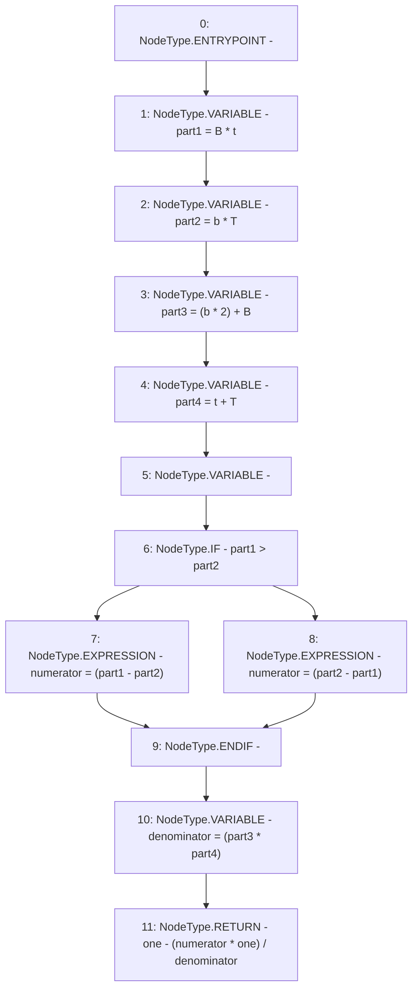

# Context: Utils.getSlipAdustment

**Contract:** `Utils` (Inherits: None)
**Signature:** `getSlipAdustment(uint256,uint256,uint256,uint256) returns (uint256)`
**Method Selector ID:** `0x6da0f1fc`
**Visibility:** `public`
**Environment-Free:** `Yes`
**Modifiers:** None

### State Variables Interaction
- **Reads:** one
- **Writes:** None

### Environment & Verification Flags
- **Uses Foundry Cheatcodes:** No
- **Has Echidna Properties:** No

### Internal Calls Tree
- None

### External Calls / Value Transfers
- None

### Control Flow Graph (CFG)


### Source Mapping
Declared in: `contracts/Utils.sol` on lines **244** to **259**

```solidity
    function getSlipAdustment(uint b, uint B, uint t, uint T) public view returns (uint){
        // slipAdjustment = (1 - ABS((B t - b T)/((2 b + B) (t + T))))
        // 1 - ABS(part1 - part2)/(part3 * part4))
        uint part1 = B * t;
        uint part2 = b * T;
        uint part3 = (b * 2) + B;
        uint part4 = t + T;
        uint numerator;
        if(part1 > part2){
            numerator = (part1 - part2);
        } else {
            numerator = (part2 - part1);
        }
        uint denominator = (part3 * part4);
        return one - (numerator * one) / denominator; // Multiply by 10**18
    }

```
