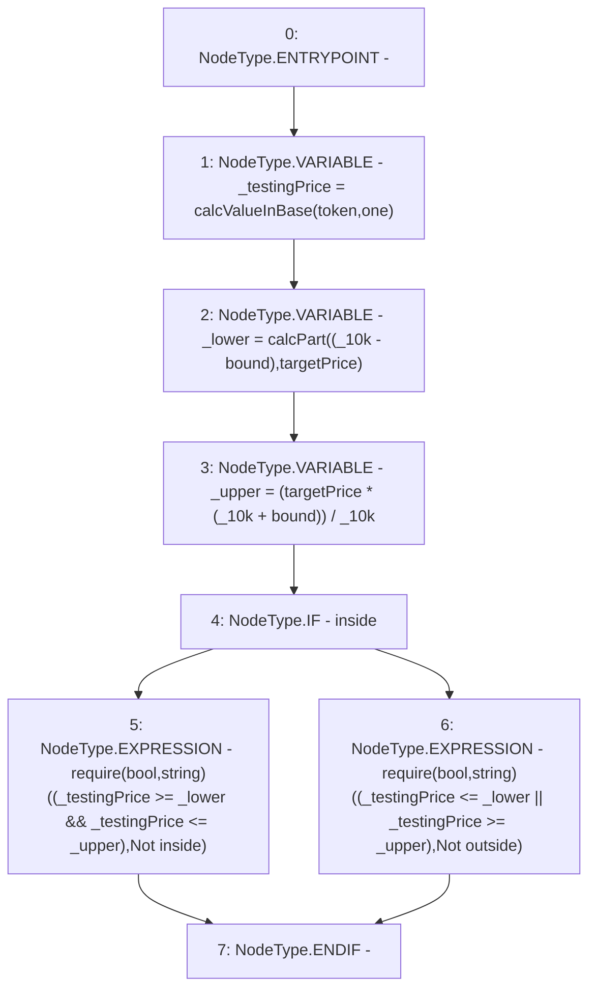

# Context: Utils.requirePriceBounds

**Contract:** `Utils` (Inherits: None)
**Signature:** `requirePriceBounds(address,uint256,bool,uint256)`
**Method Selector ID:** `0xeb7d5ddf`
**Visibility:** `external`
**Environment-Free:** `Yes`
**Modifiers:** None

### State Variables Interaction
- **Reads:** _10k, one
- **Writes:** None

### Assertion Checks & Business Requirements
- require/assert: `require(bool,string)((_testingPrice >= _lower && _testingPrice <= _upper),Not inside)`
- require/assert: `require(bool,string)((_testingPrice <= _lower || _testingPrice >= _upper),Not outside)`

### Environment & Verification Flags
- **Uses Foundry Cheatcodes:** No
- **Has Echidna Properties:** No

### Internal Calls Tree
- None

### External Calls / Value Transfers
- None

### Control Flow Graph (CFG)


### Source Mapping
Declared in: `contracts/Utils.sol` on lines **96** to **105**

```solidity
    function requirePriceBounds(address token, uint bound, bool inside, uint targetPrice) external view {
        uint _testingPrice = calcValueInBase(token, one);
        uint _lower = calcPart((_10k - bound), targetPrice);                // ie 98% of price
        uint _upper = (targetPrice * (_10k + bound)) / _10k;                // ie 105% of price
        if(inside){
            require((_testingPrice >= _lower && _testingPrice <= _upper), "Not inside");
        } else {
            require((_testingPrice <= _lower || _testingPrice >= _upper), "Not outside");
        }
    }

```
