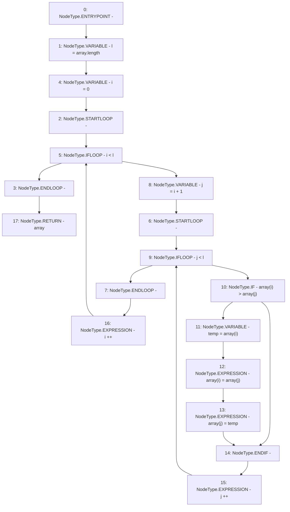

# Context: Utils.sortArray

**Contract:** `Utils` (Inherits: None)
**Signature:** `sortArray(uint256[]) returns (uint256[])`
**Method Selector ID:** `0xe379976e`
**Visibility:** `external`
**Environment-Free:** `Yes`
**Modifiers:** None

### State Variables Interaction
- **Reads:** None
- **Writes:** None

### Environment & Verification Flags
- **Uses Foundry Cheatcodes:** No
- **Has Echidna Properties:** No

### Internal Calls Tree
- None

### External Calls / Value Transfers
- None

### Control Flow Graph (CFG)


### Source Mapping
Declared in: `contracts/Utils.sol` on lines **288** to **300**

```solidity
    function sortArray(uint[] memory array) external pure returns (uint[] memory) {
        uint l = array.length;
        for(uint i = 0; i < l; i++){
            for(uint j = i+1; j < l; j++){
                if(array[i] > array[j]){
                    uint temp = array[i];
                    array[i] = array[j];
                    array[j] = temp;
                }
            }
        }
        return array;
    }

```
