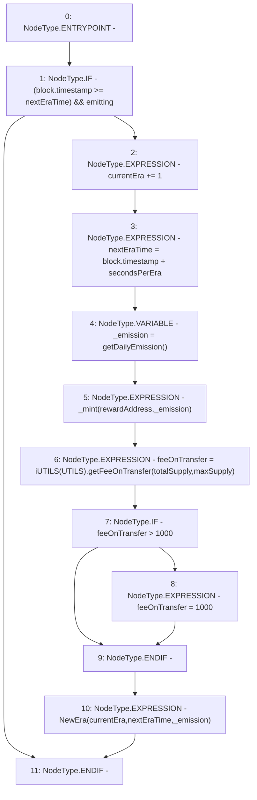

# Context: Vader._checkEmission

**Contract:** `Vader` (Inherits: iERC20)
**Signature:** `_checkEmission()`
**Method Selector ID:** `Internal (No Method ID)`
**Visibility:** `private`
**Environment-Free:** `No (reads EVM state context)`
**Modifiers:** None

### State Variables Interaction
- **Reads:** UTILS, currentEra, emitting, feeOnTransfer, maxSupply, nextEraTime, rewardAddress, secondsPerEra, totalSupply
- **Writes:** currentEra, feeOnTransfer, nextEraTime

### Environment & Verification Flags
- **Uses Foundry Cheatcodes:** No
- **Has Echidna Properties:** No

### Internal Calls Tree
- None

### External Calls / Value Transfers
- `iUTILS.TMP_1163(uint256) = HIGH_LEVEL_CALL, dest:TMP_1162(iUTILS), function:getFeeOnTransfer, arguments:['totalSupply', 'maxSupply']  `

### Control Flow Graph (CFG)


### Source Mapping
Declared in: `contracts/Vader.sol` on lines **204** to **214**

```solidity
    function _checkEmission() private {
        if ((block.timestamp >= nextEraTime) && emitting) {                                // If new Era and allowed to emit
            currentEra += 1;                                                               // Increment Era
            nextEraTime = block.timestamp + secondsPerEra;                                 // Set next Era time
            uint _emission = getDailyEmission();                                           // Get Daily Dmission
            _mint(rewardAddress, _emission);                                               // Mint to the Rewad Address
            feeOnTransfer = iUTILS(UTILS).getFeeOnTransfer(totalSupply, maxSupply);        // UpdateFeeOnTransfer
            if(feeOnTransfer > 1000){feeOnTransfer = 1000;}                                // Max 10% if UTILS corrupted
            emit NewEra(currentEra, nextEraTime, _emission);                               // Emit Event
        }
    }

```
