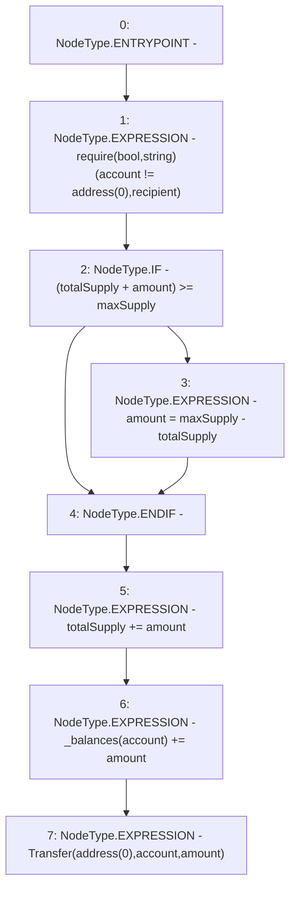

# Context: Vader._mint

**Contract:** `Vader` (Inherits: iERC20)
**Signature:** `_mint(address,uint256)`
**Method Selector ID:** `Internal (No Method ID)`
**Visibility:** `internal`
**Environment-Free:** `Yes`
**Modifiers:** None

### State Variables Interaction
- **Reads:** _balances, maxSupply, totalSupply
- **Writes:** _balances, totalSupply

### Assertion Checks & Business Requirements
- require/assert: `require(bool,string)(account != address(0),recipient)`

### Environment & Verification Flags
- **Uses Foundry Cheatcodes:** No
- **Has Echidna Properties:** No

### Internal Calls Tree
- None

### External Calls / Value Transfers
- None

### Control Flow Graph (CFG)


### Source Mapping
Declared in: `contracts/Vader.sol` on lines **136** to **144**

```solidity
    function _mint(address account, uint amount) internal virtual {
        require(account != address(0), "recipient");
        if((totalSupply + amount) >= maxSupply){
            amount = maxSupply - totalSupply;       // Safety, can't mint above maxSupply
        }
        totalSupply += amount;
        _balances[account] += amount;
        emit Transfer(address(0), account, amount);
    }

```
