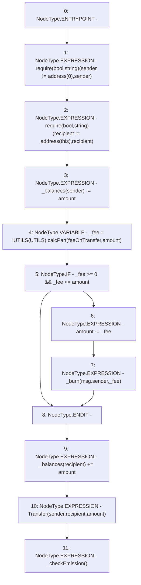

# Context: Vader._transfer

**Contract:** `Vader` (Inherits: iERC20)
**Signature:** `_transfer(address,address,uint256)`
**Method Selector ID:** `Internal (No Method ID)`
**Visibility:** `internal`
**Environment-Free:** `No (reads EVM state context)`
**Modifiers:** None

### State Variables Interaction
- **Reads:** UTILS, _balances, feeOnTransfer
- **Writes:** _balances

### Assertion Checks & Business Requirements
- require/assert: `require(bool,string)(sender != address(0),sender)`
- require/assert: `require(bool,string)(recipient != address(this),recipient)`

### Environment & Verification Flags
- **Uses Foundry Cheatcodes:** No
- **Has Echidna Properties:** No

### Internal Calls Tree
- None

### External Calls / Value Transfers
- `TMP_1113(None) = SOLIDITY_CALL require(bool,string)(TMP_1112,sender)`
- `iUTILS.TMP_1118(uint256) = HIGH_LEVEL_CALL, dest:TMP_1117(iUTILS), function:calcPart, arguments:['feeOnTransfer', 'amount']  `

### Control Flow Graph (CFG)


### Source Mapping
Declared in: `contracts/Vader.sol` on lines **122** to **134**

```solidity
    function _transfer(address sender, address recipient, uint amount) internal virtual {
        require(sender != address(0), "sender");
        require(recipient != address(this), "recipient");
        _balances[sender] -= amount;
        uint _fee = iUTILS(UTILS).calcPart(feeOnTransfer, amount);  // Critical functionality
        if(_fee >= 0 && _fee <= amount){                            // Stops reverts if UTILS corrupted
            amount -= _fee;
            _burn(msg.sender, _fee);
        }
        _balances[recipient] += amount;
        emit Transfer(sender, recipient, amount);
        _checkEmission();
    }

```
