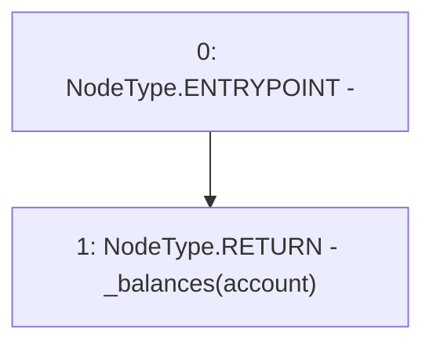

# Context: Vader.balanceOf

**Contract:** `Vader` (Inherits: iERC20)
**Signature:** `balanceOf(address) returns (uint256)`
**Method Selector ID:** `0x70a08231`
**Visibility:** `external`
**Environment-Free:** `Yes`
**Modifiers:** None

### State Variables Interaction
- **Reads:** _balances
- **Writes:** None

### Environment & Verification Flags
- **Uses Foundry Cheatcodes:** No
- **Has Echidna Properties:** No

### Internal Calls Tree
- None

### External Calls / Value Transfers
- None

### Control Flow Graph (CFG)


### Source Mapping
Declared in: `contracts/Vader.sol` on lines **84** to **86**

```solidity
    function balanceOf(address account) external view override returns (uint) {
        return _balances[account];
    }

```
