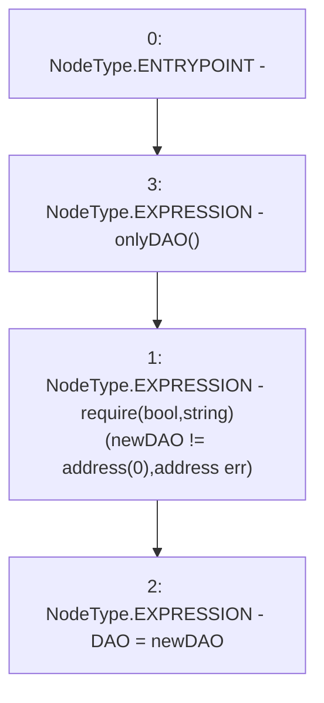

# Context: Vader.changeDAO

**Contract:** `Vader` (Inherits: iERC20)
**Signature:** `changeDAO(address)`
**Method Selector ID:** `0x1d007f5f`
**Visibility:** `external`
**Environment-Free:** `No (reads EVM state context)`
**Modifiers:**
- `onlyDAO`
  ```solidity
  modifier onlyDAO() {
          require(msg.sender == DAO, "Not DAO");
          _;
      }
  ```

### State Variables Interaction
- **Reads:** None
- **Writes:** DAO

### Assertion Checks & Business Requirements
- require/assert: `require(bool,string)(newDAO != address(0),address err)`

### Environment & Verification Flags
- **Uses Foundry Cheatcodes:** No
- **Has Echidna Properties:** No

### Internal Calls Tree
- None

### External Calls / Value Transfers
- None

### Control Flow Graph (CFG)


### Source Mapping
Declared in: `contracts/Vader.sol` on lines **193** to **196**

```solidity
    function changeDAO(address newDAO) external onlyDAO {
        require(newDAO != address(0), "address err");
        DAO = newDAO;
    }

```
