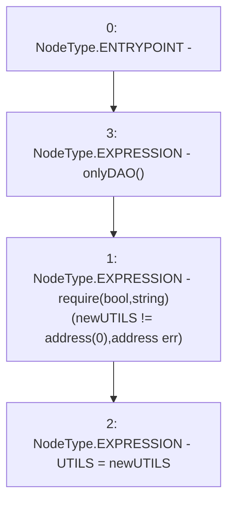

# Context: Vader.changeUTILS

**Contract:** `Vader` (Inherits: iERC20)
**Signature:** `changeUTILS(address)`
**Method Selector ID:** `0x19234334`
**Visibility:** `external`
**Environment-Free:** `No (reads EVM state context)`
**Modifiers:**
- `onlyDAO`
  ```solidity
  modifier onlyDAO() {
          require(msg.sender == DAO, "Not DAO");
          _;
      }
  ```

### State Variables Interaction
- **Reads:** None
- **Writes:** UTILS

### Assertion Checks & Business Requirements
- require/assert: `require(bool,string)(newUTILS != address(0),address err)`

### Environment & Verification Flags
- **Uses Foundry Cheatcodes:** No
- **Has Echidna Properties:** No

### Internal Calls Tree
- None

### External Calls / Value Transfers
- None

### Control Flow Graph (CFG)


### Source Mapping
Declared in: `contracts/Vader.sol` on lines **188** to **191**

```solidity
    function changeUTILS(address newUTILS) external onlyDAO {
        require(newUTILS != address(0), "address err");
        UTILS = newUTILS;
    }

```
