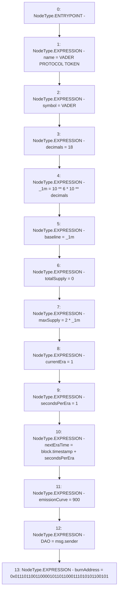

# Context: Vader.constructor

**Contract:** `Vader` (Inherits: iERC20)
**Signature:** `constructor()`
**Method Selector ID:** `0x90fa17bb`
**Visibility:** `public`
**Environment-Free:** `No (reads EVM state context)`
**Modifiers:** None

### State Variables Interaction
- **Reads:** _1m, decimals, secondsPerEra
- **Writes:** DAO, _1m, baseline, burnAddress, currentEra, decimals, emissionCurve, maxSupply, name, nextEraTime, secondsPerEra, symbol, totalSupply

### Environment & Verification Flags
- **Uses Foundry Cheatcodes:** No
- **Has Echidna Properties:** No

### Internal Calls Tree
- None

### External Calls / Value Transfers
- None

### Control Flow Graph (CFG)


### Source Mapping
Declared in: `contracts/Vader.sol` on lines **58** to **72**

```solidity
    constructor() {
        name = 'VADER PROTOCOL TOKEN';
        symbol = 'VADER';
        decimals = 18;
        _1m = 10**6 * 10 ** decimals; //1m
        baseline = _1m;
        totalSupply = 0;
        maxSupply = 2 * _1m;
        currentEra = 1;
        secondsPerEra = 1; //86400;
        nextEraTime = block.timestamp + secondsPerEra;
        emissionCurve = 900;
        DAO = msg.sender;
        burnAddress = 0x0111011001100001011011000111010101100101;
    }

```
