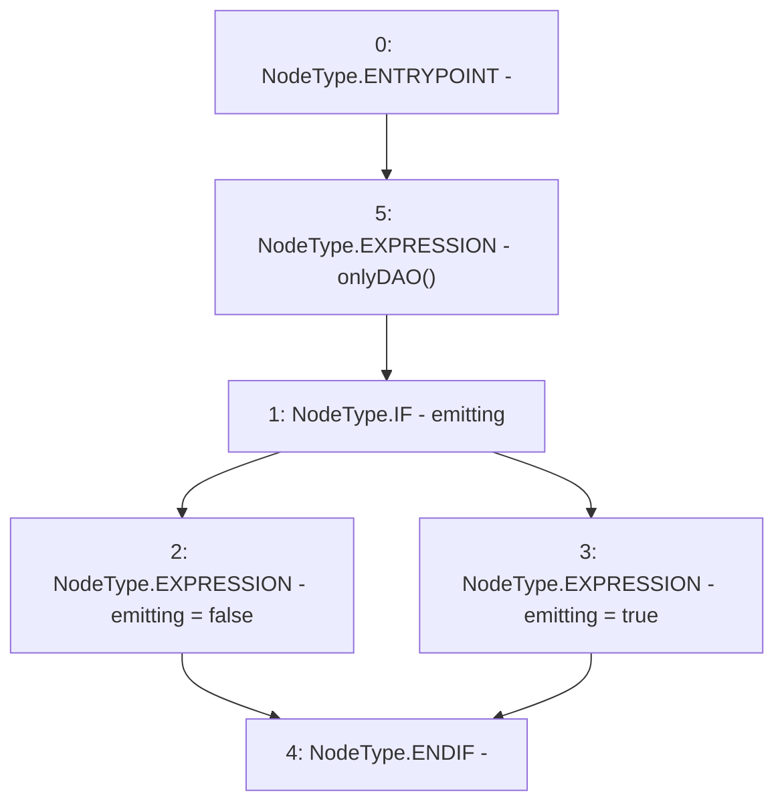

# Context: Vader.flipEmissions

**Contract:** `Vader` (Inherits: iERC20)
**Signature:** `flipEmissions()`
**Method Selector ID:** `0xfe1fa8fa`
**Visibility:** `external`
**Environment-Free:** `No (reads EVM state context)`
**Modifiers:**
- `onlyDAO`
  ```solidity
  modifier onlyDAO() {
          require(msg.sender == DAO, "Not DAO");
          _;
      }
  ```

### State Variables Interaction
- **Reads:** emitting
- **Writes:** emitting

### Environment & Verification Flags
- **Uses Foundry Cheatcodes:** No
- **Has Echidna Properties:** No

### Internal Calls Tree
- None

### External Calls / Value Transfers
- None

### Control Flow Graph (CFG)


### Source Mapping
Declared in: `contracts/Vader.sol` on lines **163** to **169**

```solidity
    function flipEmissions() external onlyDAO {
        if(emitting){
            emitting = false;
        } else {
            emitting = true;
        }
    }

```
