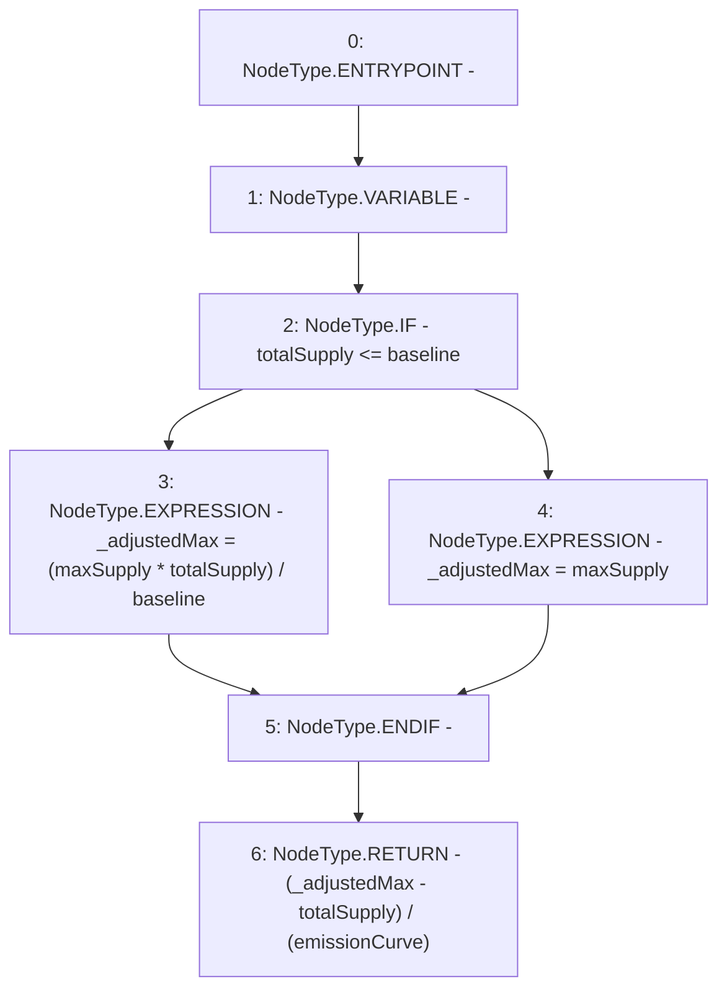

# Context: Vader.getDailyEmission

**Contract:** `Vader` (Inherits: iERC20)
**Signature:** `getDailyEmission() returns (uint256)`
**Method Selector ID:** `0xf293e675`
**Visibility:** `public`
**Environment-Free:** `Yes`
**Modifiers:** None

### State Variables Interaction
- **Reads:** baseline, emissionCurve, maxSupply, totalSupply
- **Writes:** None

### Environment & Verification Flags
- **Uses Foundry Cheatcodes:** No
- **Has Echidna Properties:** No

### Internal Calls Tree
- None

### External Calls / Value Transfers
- None

### Control Flow Graph (CFG)


### Source Mapping
Declared in: `contracts/Vader.sol` on lines **216** to **224**

```solidity
    function getDailyEmission() public view returns (uint) {
        uint _adjustedMax;
        if(totalSupply <= baseline){ // If less than 1m, then adjust cap down
            _adjustedMax = (maxSupply * totalSupply) / baseline; // 2m * 0.5m / 1m = 2m * 50% = 1.5m
        } else {
            _adjustedMax = maxSupply;  // 2m
        }
        return (_adjustedMax - totalSupply) / (emissionCurve); // outstanding / curve 
    }

```
