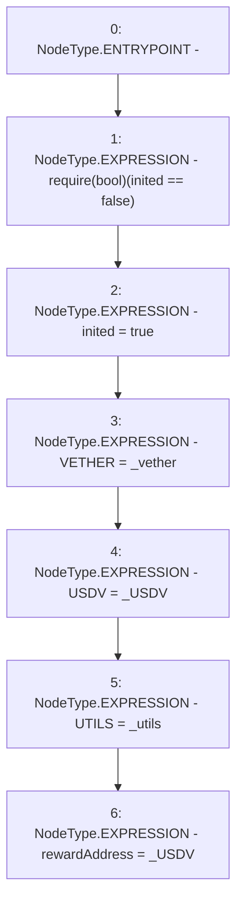

# Context: Vader.init

**Contract:** `Vader` (Inherits: iERC20)
**Signature:** `init(address,address,address)`
**Method Selector ID:** `0x184b9559`
**Visibility:** `external`
**Environment-Free:** `Yes`
**Modifiers:** None

### State Variables Interaction
- **Reads:** inited
- **Writes:** USDV, UTILS, VETHER, inited, rewardAddress

### Assertion Checks & Business Requirements
- require/assert: `require(bool)(inited == false)`

### Environment & Verification Flags
- **Uses Foundry Cheatcodes:** No
- **Has Echidna Properties:** No

### Internal Calls Tree
- None

### External Calls / Value Transfers
- None

### Control Flow Graph (CFG)


### Source Mapping
Declared in: `contracts/Vader.sol` on lines **74** to **81**

```solidity
    function init(address _vether, address _USDV, address _utils) external {
        require(inited == false);
        inited = true;
        VETHER = _vether;
        USDV = _USDV;
        UTILS = _utils;
        rewardAddress = _USDV;
    }

```
