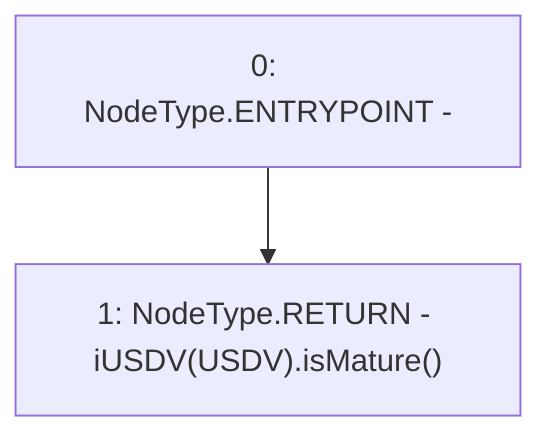

# Context: Vader.isMature

**Contract:** `Vader` (Inherits: iERC20)
**Signature:** `isMature() returns (bool)`
**Method Selector ID:** `0xae4e7fdf`
**Visibility:** `public`
**Environment-Free:** `Yes`
**Modifiers:** None

### State Variables Interaction
- **Reads:** USDV
- **Writes:** None

### Environment & Verification Flags
- **Uses Foundry Cheatcodes:** No
- **Has Echidna Properties:** No

### Internal Calls Tree
- None

### External Calls / Value Transfers
- `iUSDV.TMP_1090(bool) = HIGH_LEVEL_CALL, dest:TMP_1089(iUSDV), function:isMature, arguments:[]  `

### Control Flow Graph (CFG)


### Source Mapping
Declared in: `contracts/Vader.sol` on lines **52** to **54**

```solidity
    function isMature() public view returns(bool){
        return iUSDV(USDV).isMature();
    }

```
