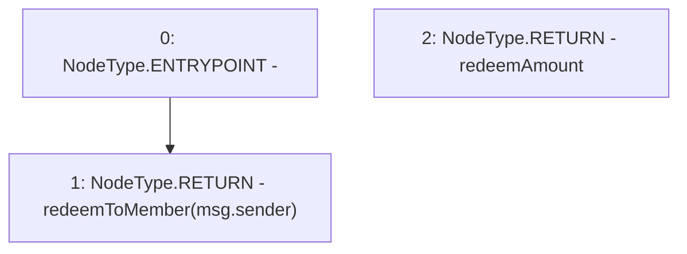

# Context: Vader.redeem

**Contract:** `Vader` (Inherits: iERC20)
**Signature:** `redeem() returns (uint256)`
**Method Selector ID:** `0xbe040fb0`
**Visibility:** `external`
**Environment-Free:** `No (reads EVM state context)`
**Modifiers:** None

### State Variables Interaction
- **Reads:** None
- **Writes:** None

### Environment & Verification Flags
- **Uses Foundry Cheatcodes:** No
- **Has Echidna Properties:** No

### Internal Calls Tree
- None

### External Calls / Value Transfers
- None

### Control Flow Graph (CFG)


### Source Mapping
Declared in: `contracts/Vader.sol` on lines **233** to **235**

```solidity
    function redeem() external returns (uint redeemAmount){
        return redeemToMember(msg.sender);
    }

```
