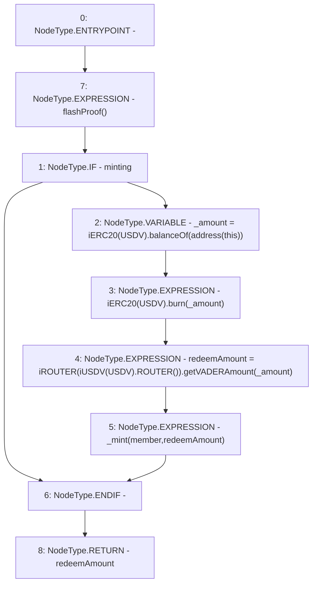

# Context: Vader.redeemToMember

**Contract:** `Vader` (Inherits: iERC20)
**Signature:** `redeemToMember(address) returns (uint256)`
**Method Selector ID:** `0xc30a0ce7`
**Visibility:** `public`
**Environment-Free:** `Yes`
**Modifiers:**
- `flashProof`
  ```solidity
  modifier flashProof() {
          require(isMature(), "No flash");
          _;
      }
  ```

### State Variables Interaction
- **Reads:** USDV, minting
- **Writes:** None

### Environment & Verification Flags
- **Uses Foundry Cheatcodes:** No
- **Has Echidna Properties:** No

### Internal Calls Tree
- None

### External Calls / Value Transfers
- `iROUTER.TMP_1184(uint256) = HIGH_LEVEL_CALL, dest:TMP_1183(iROUTER), function:getVADERAmount, arguments:['_amount']  `
- `iERC20.TMP_1178(uint256) = HIGH_LEVEL_CALL, dest:TMP_1176(iERC20), function:balanceOf, arguments:['TMP_1177']  `
- `iUSDV.TMP_1182(address) = HIGH_LEVEL_CALL, dest:TMP_1181(iUSDV), function:ROUTER, arguments:[]  `
- `iERC20.HIGH_LEVEL_CALL, dest:TMP_1179(iERC20), function:burn, arguments:['_amount']  `

### Control Flow Graph (CFG)


### Source Mapping
Declared in: `contracts/Vader.sol` on lines **237** to **244**

```solidity
    function redeemToMember(address member) public flashProof returns (uint redeemAmount){
        if(minting){
            uint _amount = iERC20(USDV).balanceOf(address(this)); 
            iERC20(USDV).burn(_amount);
            redeemAmount = iROUTER(iUSDV(USDV).ROUTER()).getVADERAmount(_amount); // Critical pricing functionality
            _mint(member, redeemAmount);
        }
    }

```
