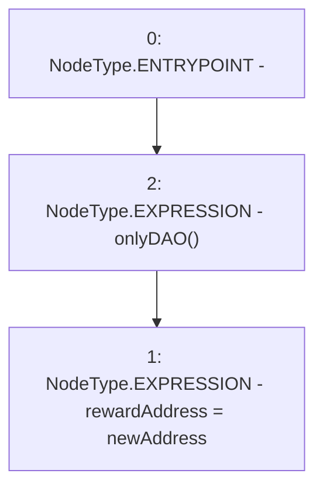

# Context: Vader.setRewardAddress

**Contract:** `Vader` (Inherits: iERC20)
**Signature:** `setRewardAddress(address)`
**Method Selector ID:** `0x5e00e679`
**Visibility:** `external`
**Environment-Free:** `No (reads EVM state context)`
**Modifiers:**
- `onlyDAO`
  ```solidity
  modifier onlyDAO() {
          require(msg.sender == DAO, "Not DAO");
          _;
      }
  ```

### State Variables Interaction
- **Reads:** None
- **Writes:** rewardAddress

### Environment & Verification Flags
- **Uses Foundry Cheatcodes:** No
- **Has Echidna Properties:** No

### Internal Calls Tree
- None

### External Calls / Value Transfers
- None

### Control Flow Graph (CFG)


### Source Mapping
Declared in: `contracts/Vader.sol` on lines **184** to **186**

```solidity
    function setRewardAddress(address newAddress) external onlyDAO {
        rewardAddress = newAddress;
    }

```
