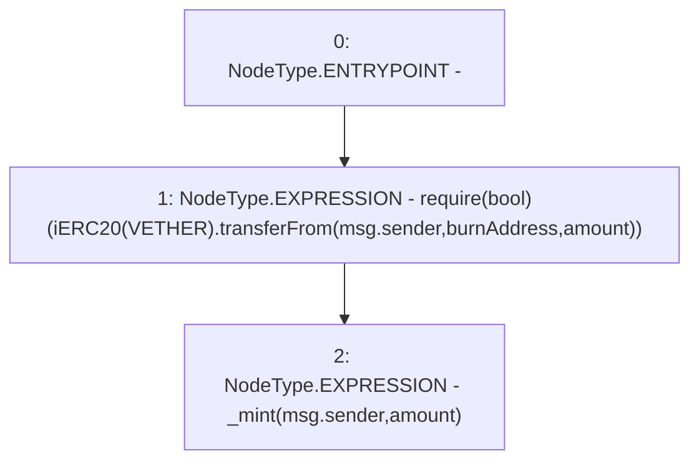

# Context: Vader.upgrade

**Contract:** `Vader` (Inherits: iERC20)
**Signature:** `upgrade(uint256)`
**Method Selector ID:** `0x45977d03`
**Visibility:** `external`
**Environment-Free:** `No (reads EVM state context)`
**Modifiers:** None

### State Variables Interaction
- **Reads:** VETHER, burnAddress
- **Writes:** None

### Assertion Checks & Business Requirements
- require/assert: `require(bool)(iERC20(VETHER).transferFrom(msg.sender,burnAddress,amount))`

### Environment & Verification Flags
- **Uses Foundry Cheatcodes:** No
- **Has Echidna Properties:** No

### Internal Calls Tree
- None

### External Calls / Value Transfers
- `iERC20.TMP_1172(bool) = HIGH_LEVEL_CALL, dest:TMP_1171(iERC20), function:transferFrom, arguments:['msg.sender', 'burnAddress', 'amount']  `

### Control Flow Graph (CFG)


### Source Mapping
Declared in: `contracts/Vader.sol` on lines **228** to **231**

```solidity
    function upgrade(uint amount) external {
        require(iERC20(VETHER).transferFrom(msg.sender, burnAddress, amount));
        _mint(msg.sender, amount);
    }

```
