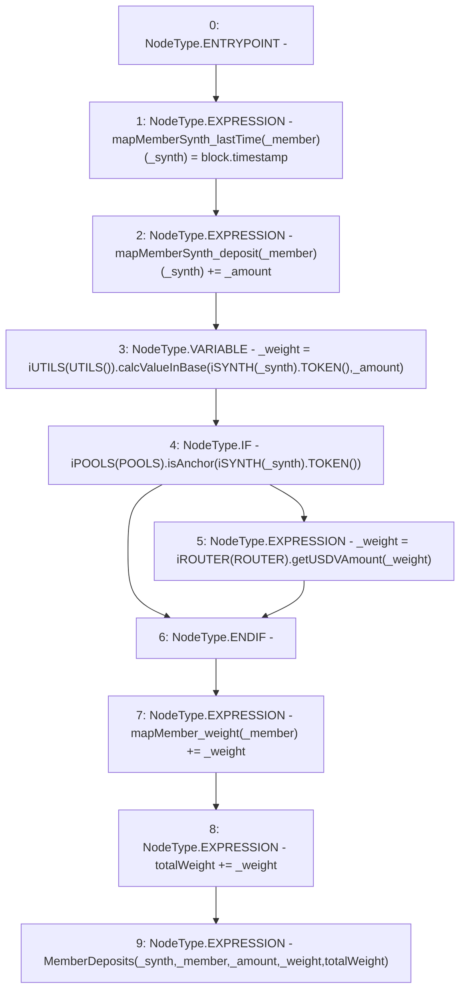

# Context: Vault._deposit

**Contract:** `Vault` (Inherits: None)
**Signature:** `_deposit(address,address,uint256)`
**Method Selector ID:** `Internal (No Method ID)`
**Visibility:** `internal`
**Environment-Free:** `No (reads EVM state context)`
**Modifiers:** None

### State Variables Interaction
- **Reads:** POOLS, ROUTER, mapMemberSynth_deposit, mapMember_weight, totalWeight
- **Writes:** mapMemberSynth_deposit, mapMemberSynth_lastTime, mapMember_weight, totalWeight

### Environment & Verification Flags
- **Uses Foundry Cheatcodes:** No
- **Has Echidna Properties:** No

### Internal Calls Tree
- None

### External Calls / Value Transfers
- `iUTILS.TMP_1210(uint256) = HIGH_LEVEL_CALL, dest:TMP_1207(iUTILS), function:calcValueInBase, arguments:['TMP_1209', '_amount']  `
- `iSYNTH.TMP_1209(address) = HIGH_LEVEL_CALL, dest:TMP_1208(iSYNTH), function:TOKEN, arguments:[]  `
- `iPOOLS.TMP_1214(bool) = HIGH_LEVEL_CALL, dest:TMP_1211(iPOOLS), function:isAnchor, arguments:['TMP_1213']  `
- `iROUTER.TMP_1216(uint256) = HIGH_LEVEL_CALL, dest:TMP_1215(iROUTER), function:getUSDVAmount, arguments:['_weight']  `
- `iSYNTH.TMP_1213(address) = HIGH_LEVEL_CALL, dest:TMP_1212(iSYNTH), function:TOKEN, arguments:[]  `

### Control Flow Graph (CFG)


### Source Mapping
Declared in: `contracts/Vault.sol` on lines **86** to **96**

```solidity
    function _deposit(address _synth, address _member, uint _amount) internal {
        mapMemberSynth_lastTime[_member][_synth] = block.timestamp;         // Time of deposit
        mapMemberSynth_deposit[_member][_synth] += _amount;                 // Record deposit
        uint _weight = iUTILS(UTILS()).calcValueInBase(iSYNTH(_synth).TOKEN(), _amount);
        if(iPOOLS(POOLS).isAnchor(iSYNTH(_synth).TOKEN())){
            _weight = iROUTER(ROUTER).getUSDVAmount(_weight);               // Price in USDV
        }
        mapMember_weight[_member] += _weight;                               // Total member weight 
        totalWeight += _weight;                                             // Total weight 
        emit MemberDeposits(_synth, _member, _amount, _weight, totalWeight);
    }

```
