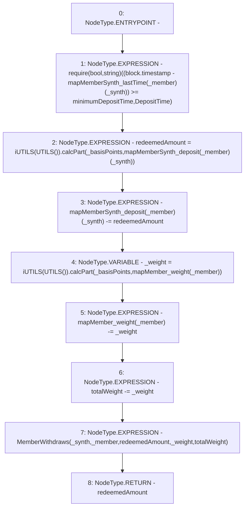

# Context: Vault._processWithdraw

**Contract:** `Vault` (Inherits: None)
**Signature:** `_processWithdraw(address,address,uint256) returns (uint256)`
**Method Selector ID:** `Internal (No Method ID)`
**Visibility:** `internal`
**Environment-Free:** `No (reads EVM state context)`
**Modifiers:** None

### State Variables Interaction
- **Reads:** mapMemberSynth_deposit, mapMemberSynth_lastTime, mapMember_weight, minimumDepositTime, totalWeight
- **Writes:** mapMemberSynth_deposit, mapMember_weight, totalWeight

### Assertion Checks & Business Requirements
- require/assert: `require(bool,string)((block.timestamp - mapMemberSynth_lastTime[_member][_synth]) >= minimumDepositTime,DepositTime)`

### Environment & Verification Flags
- **Uses Foundry Cheatcodes:** No
- **Has Echidna Properties:** No

### Internal Calls Tree
- None

### External Calls / Value Transfers
- `iUTILS.TMP_1287(uint256) = HIGH_LEVEL_CALL, dest:TMP_1286(iUTILS), function:calcPart, arguments:['_basisPoints', 'REF_539']  `
- `iUTILS.TMP_1284(uint256) = HIGH_LEVEL_CALL, dest:TMP_1283(iUTILS), function:calcPart, arguments:['_basisPoints', 'REF_535']  `

### Control Flow Graph (CFG)


### Source Mapping
Declared in: `contracts/Vault.sol` on lines **156** to **164**

```solidity
    function _processWithdraw(address _synth, address _member, uint _basisPoints) internal returns(uint redeemedAmount) {
        require((block.timestamp - mapMemberSynth_lastTime[_member][_synth]) >= minimumDepositTime, "DepositTime");    // stops attacks
        redeemedAmount = iUTILS(UTILS()).calcPart(_basisPoints, mapMemberSynth_deposit[_member][_synth]); // Share of deposits
        mapMemberSynth_deposit[_member][_synth] -= redeemedAmount;                  // Reduce for member                             
        uint _weight = iUTILS(UTILS()).calcPart(_basisPoints, mapMember_weight[_member]);   // Find recorded weight to reduce
        mapMember_weight[_member] -= _weight;                                   // Reduce for member 
        totalWeight -= _weight;                                                 // Reduce for total
        emit MemberWithdraws(_synth, _member, redeemedAmount, _weight, totalWeight);   // Event
    }

```
