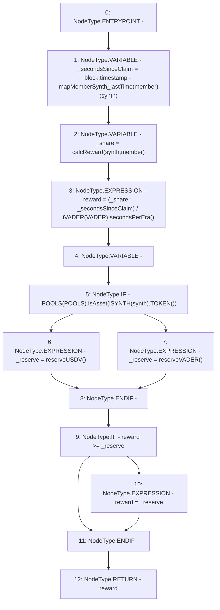

# Context: Vault.calcCurrentReward

**Contract:** `Vault` (Inherits: None)
**Signature:** `calcCurrentReward(address,address) returns (uint256)`
**Method Selector ID:** `0xe9f27c3a`
**Visibility:** `public`
**Environment-Free:** `No (reads EVM state context)`
**Modifiers:** None

### State Variables Interaction
- **Reads:** POOLS, VADER, mapMemberSynth_lastTime
- **Writes:** None

### Environment & Verification Flags
- **Uses Foundry Cheatcodes:** No
- **Has Echidna Properties:** No

### Internal Calls Tree
- None

### External Calls / Value Transfers
- `iPOOLS.TMP_1251(bool) = HIGH_LEVEL_CALL, dest:TMP_1248(iPOOLS), function:isAsset, arguments:['TMP_1250']  `
- `iVADER.TMP_1246(uint256) = HIGH_LEVEL_CALL, dest:TMP_1245(iVADER), function:secondsPerEra, arguments:[]  `
- `iSYNTH.TMP_1250(address) = HIGH_LEVEL_CALL, dest:TMP_1249(iSYNTH), function:TOKEN, arguments:[]  `

### Control Flow Graph (CFG)


### Source Mapping
Declared in: `contracts/Vault.sol` on lines **123** to **136**

```solidity
    function calcCurrentReward(address synth, address member) public view returns(uint reward) {
        uint _secondsSinceClaim = block.timestamp - mapMemberSynth_lastTime[member][synth];        // Get time since last claim
        uint _share = calcReward(synth, member);                                               // Get share of rewards for member
        reward = (_share * _secondsSinceClaim) / iVADER(VADER).secondsPerEra();         // Get owed amount, based on per-day rates
        uint _reserve;
        if(iPOOLS(POOLS).isAsset(iSYNTH(synth).TOKEN())){
            _reserve = reserveUSDV();
        } else {
            _reserve = reserveVADER();
        }
        if(reward >= _reserve) {
            reward = _reserve;                                                          // Send full reserve if the last
        }
    }

```
