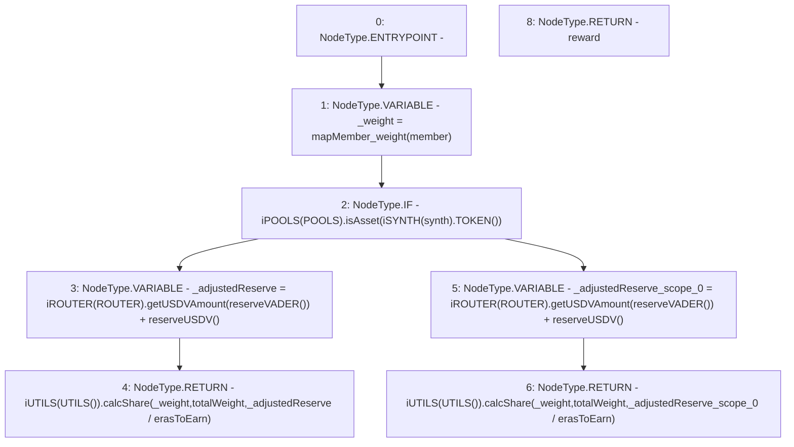

# Context: Vault.calcReward

**Contract:** `Vault` (Inherits: None)
**Signature:** `calcReward(address,address) returns (uint256)`
**Method Selector ID:** `0xa6dde131`
**Visibility:** `public`
**Environment-Free:** `Yes`
**Modifiers:** None

### State Variables Interaction
- **Reads:** POOLS, ROUTER, erasToEarn, mapMember_weight, totalWeight
- **Writes:** None

### Environment & Verification Flags
- **Uses Foundry Cheatcodes:** No
- **Has Echidna Properties:** No

### Internal Calls Tree
- None

### External Calls / Value Transfers
- `iUTILS.TMP_1267(uint256) = HIGH_LEVEL_CALL, dest:TMP_1265(iUTILS), function:calcShare, arguments:['_weight', 'totalWeight', 'TMP_1266']  `
- `iSYNTH.TMP_1257(address) = HIGH_LEVEL_CALL, dest:TMP_1256(iSYNTH), function:TOKEN, arguments:[]  `
- `iPOOLS.TMP_1258(bool) = HIGH_LEVEL_CALL, dest:TMP_1255(iPOOLS), function:isAsset, arguments:['TMP_1257']  `
- `iROUTER.TMP_1261(uint256) = HIGH_LEVEL_CALL, dest:TMP_1259(iROUTER), function:getUSDVAmount, arguments:['TMP_1260']  `
- `iROUTER.TMP_1270(uint256) = HIGH_LEVEL_CALL, dest:TMP_1268(iROUTER), function:getUSDVAmount, arguments:['TMP_1269']  `
- `iUTILS.TMP_1276(uint256) = HIGH_LEVEL_CALL, dest:TMP_1274(iUTILS), function:calcShare, arguments:['_weight', 'totalWeight', 'TMP_1275']  `

### Control Flow Graph (CFG)


### Source Mapping
Declared in: `contracts/Vault.sol` on lines **138** to **147**

```solidity
    function calcReward(address synth, address member) public view returns(uint reward) {
        uint _weight = mapMember_weight[member];  
        if(iPOOLS(POOLS).isAsset(iSYNTH(synth).TOKEN())){
            uint _adjustedReserve = iROUTER(ROUTER).getUSDVAmount(reserveVADER()) + reserveUSDV();      // Aggregrate reserves
            return iUTILS(UTILS()).calcShare(_weight, totalWeight, _adjustedReserve / erasToEarn);                   // Get member's share of that
        } else{
            uint _adjustedReserve = iROUTER(ROUTER).getUSDVAmount(reserveVADER()) + reserveUSDV();
            return iUTILS(UTILS()).calcShare(_weight, totalWeight, _adjustedReserve / erasToEarn);          
        }
    }

```
