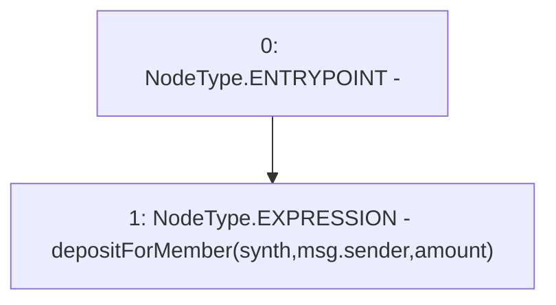

# Context: Vault.deposit

**Contract:** `Vault` (Inherits: None)
**Signature:** `deposit(address,uint256)`
**Method Selector ID:** `0x47e7ef24`
**Visibility:** `external`
**Environment-Free:** `No (reads EVM state context)`
**Modifiers:** None

### State Variables Interaction
- **Reads:** None
- **Writes:** None

### Environment & Verification Flags
- **Uses Foundry Cheatcodes:** No
- **Has Echidna Properties:** No

### Internal Calls Tree
- None

### External Calls / Value Transfers
- None

### Control Flow Graph (CFG)


### Source Mapping
Declared in: `contracts/Vault.sol` on lines **77** to **79**

```solidity
    function deposit(address synth, uint amount) external {
        depositForMember(synth, msg.sender, amount);
    }

```
