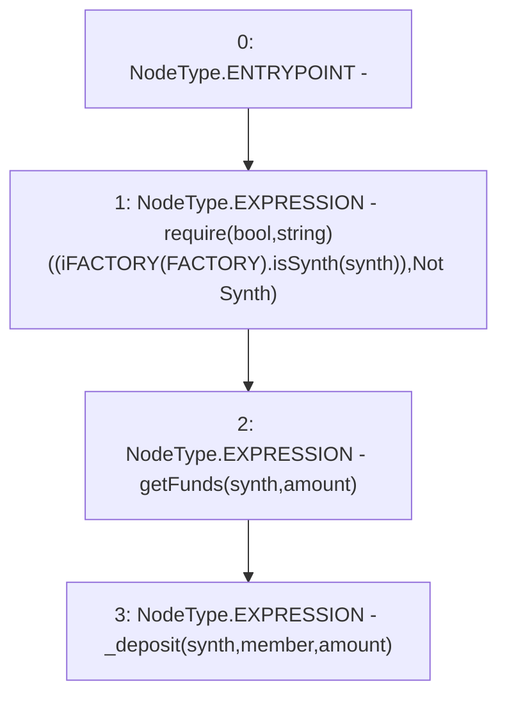

# Context: Vault.depositForMember

**Contract:** `Vault` (Inherits: None)
**Signature:** `depositForMember(address,address,uint256)`
**Method Selector ID:** `0xbf58d0ef`
**Visibility:** `public`
**Environment-Free:** `No (reads EVM state context)`
**Modifiers:** None

### State Variables Interaction
- **Reads:** FACTORY
- **Writes:** None

### Assertion Checks & Business Requirements
- require/assert: `require(bool,string)((iFACTORY(FACTORY).isSynth(synth)),Not Synth)`

### Environment & Verification Flags
- **Uses Foundry Cheatcodes:** No
- **Has Echidna Properties:** No

### Internal Calls Tree
- None

### External Calls / Value Transfers
- `iFACTORY.TMP_1202(bool) = HIGH_LEVEL_CALL, dest:TMP_1201(iFACTORY), function:isSynth, arguments:['synth']  `

### Control Flow Graph (CFG)


### Source Mapping
Declared in: `contracts/Vault.sol` on lines **81** to **85**

```solidity
    function depositForMember(address synth, address member, uint amount) public {
        require((iFACTORY(FACTORY).isSynth(synth)), "Not Synth"); // Only Synths
        getFunds(synth, amount);
        _deposit(synth, member, amount);
    }

```
