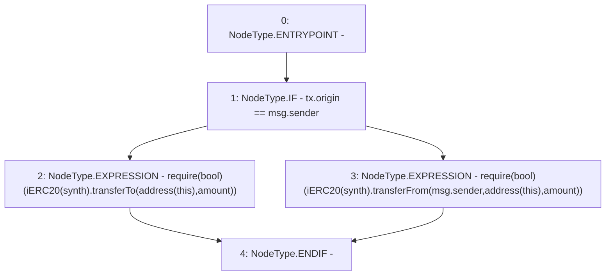

# Context: Vault.getFunds

**Contract:** `Vault` (Inherits: None)
**Signature:** `getFunds(address,uint256)`
**Method Selector ID:** `Internal (No Method ID)`
**Visibility:** `internal`
**Environment-Free:** `No (reads EVM state context)`
**Modifiers:** None

### State Variables Interaction
- **Reads:** None
- **Writes:** None

### Assertion Checks & Business Requirements
- require/assert: `require(bool)(iERC20(synth).transferTo(address(this),amount))`
- require/assert: `require(bool)(iERC20(synth).transferFrom(msg.sender,address(this),amount))`

### Environment & Verification Flags
- **Uses Foundry Cheatcodes:** No
- **Has Echidna Properties:** No

### Internal Calls Tree
- None

### External Calls / Value Transfers
- `iERC20.TMP_1296(bool) = HIGH_LEVEL_CALL, dest:TMP_1294(iERC20), function:transferFrom, arguments:['msg.sender', 'TMP_1295', 'amount']  `
- `iERC20.TMP_1292(bool) = HIGH_LEVEL_CALL, dest:TMP_1290(iERC20), function:transferTo, arguments:['TMP_1291', 'amount']  `

### Control Flow Graph (CFG)


### Source Mapping
Declared in: `contracts/Vault.sol` on lines **168** to **174**

```solidity
    function getFunds(address synth, uint amount) internal {
        if(tx.origin==msg.sender){
            require(iERC20(synth).transferTo(address(this), amount));
        }else{
            require(iERC20(synth).transferFrom(msg.sender, address(this), amount));
        }
    }

```
