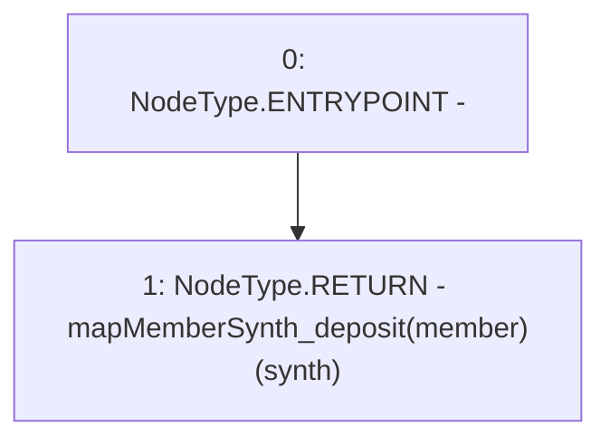

# Context: Vault.getMemberDeposit

**Contract:** `Vault` (Inherits: None)
**Signature:** `getMemberDeposit(address,address) returns (uint256)`
**Method Selector ID:** `0x8dfa9bcc`
**Visibility:** `external`
**Environment-Free:** `Yes`
**Modifiers:** None

### State Variables Interaction
- **Reads:** mapMemberSynth_deposit
- **Writes:** None

### Environment & Verification Flags
- **Uses Foundry Cheatcodes:** No
- **Has Echidna Properties:** No

### Internal Calls Tree
- None

### External Calls / Value Transfers
- None

### Control Flow Graph (CFG)


### Source Mapping
Declared in: `contracts/Vault.sol` on lines **188** to **190**

```solidity
    function getMemberDeposit(address synth, address member) external view returns(uint){
        return mapMemberSynth_deposit[member][synth];
    }

```
