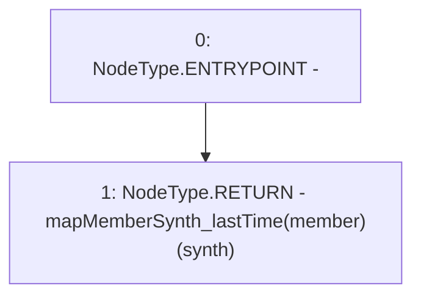

# Context: Vault.getMemberLastTime

**Contract:** `Vault` (Inherits: None)
**Signature:** `getMemberLastTime(address,address) returns (uint256)`
**Method Selector ID:** `0x02d0e1ae`
**Visibility:** `external`
**Environment-Free:** `Yes`
**Modifiers:** None

### State Variables Interaction
- **Reads:** mapMemberSynth_lastTime
- **Writes:** None

### Environment & Verification Flags
- **Uses Foundry Cheatcodes:** No
- **Has Echidna Properties:** No

### Internal Calls Tree
- None

### External Calls / Value Transfers
- None

### Control Flow Graph (CFG)


### Source Mapping
Declared in: `contracts/Vault.sol` on lines **194** to **196**

```solidity
    function getMemberLastTime(address synth, address member) external view returns(uint){
        return mapMemberSynth_lastTime[member][synth];
    }

```
