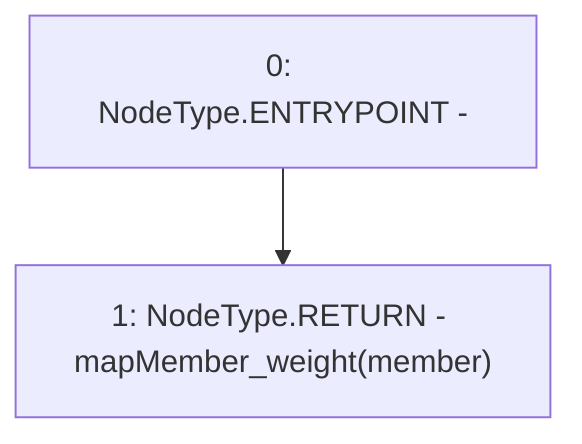

# Context: Vault.getMemberWeight

**Contract:** `Vault` (Inherits: None)
**Signature:** `getMemberWeight(address) returns (uint256)`
**Method Selector ID:** `0x5364df49`
**Visibility:** `external`
**Environment-Free:** `Yes`
**Modifiers:** None

### State Variables Interaction
- **Reads:** mapMember_weight
- **Writes:** None

### Environment & Verification Flags
- **Uses Foundry Cheatcodes:** No
- **Has Echidna Properties:** No

### Internal Calls Tree
- None

### External Calls / Value Transfers
- None

### Control Flow Graph (CFG)


### Source Mapping
Declared in: `contracts/Vault.sol` on lines **191** to **193**

```solidity
    function getMemberWeight(address member) external view returns(uint){
        return mapMember_weight[member];
    }

```
