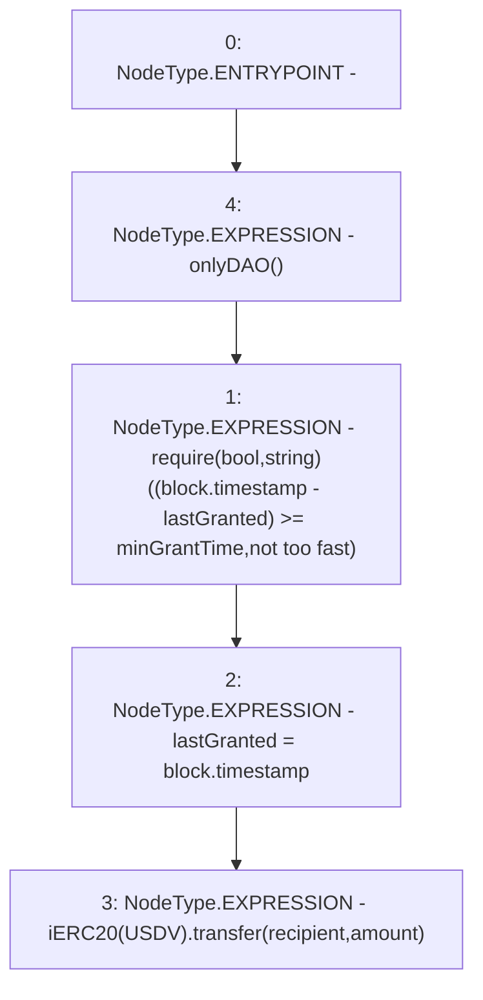

# Context: Vault.grant

**Contract:** `Vault` (Inherits: None)
**Signature:** `grant(address,uint256)`
**Method Selector ID:** `0x6370920e`
**Visibility:** `public`
**Environment-Free:** `No (reads EVM state context)`
**Modifiers:**
- `onlyDAO`
  ```solidity
  modifier onlyDAO() {
          require(msg.sender == DAO(), "Not DAO");
          _;
      }
  ```

### State Variables Interaction
- **Reads:** USDV, lastGranted, minGrantTime
- **Writes:** lastGranted

### Assertion Checks & Business Requirements
- require/assert: `require(bool,string)((block.timestamp - lastGranted) >= minGrantTime,not too fast)`

### Environment & Verification Flags
- **Uses Foundry Cheatcodes:** No
- **Has Echidna Properties:** No

### Internal Calls Tree
- None

### External Calls / Value Transfers
- `iERC20.TMP_1198(bool) = HIGH_LEVEL_CALL, dest:TMP_1197(iERC20), function:transfer, arguments:['recipient', 'amount']  `

### Control Flow Graph (CFG)


### Source Mapping
Declared in: `contracts/Vault.sol` on lines **68** to **72**

```solidity
    function grant(address recipient, uint amount) public onlyDAO {
        require((block.timestamp - lastGranted) >= minGrantTime, "not too fast");
        lastGranted = block.timestamp;
        iERC20(USDV).transfer(recipient, amount); 
    }

```
