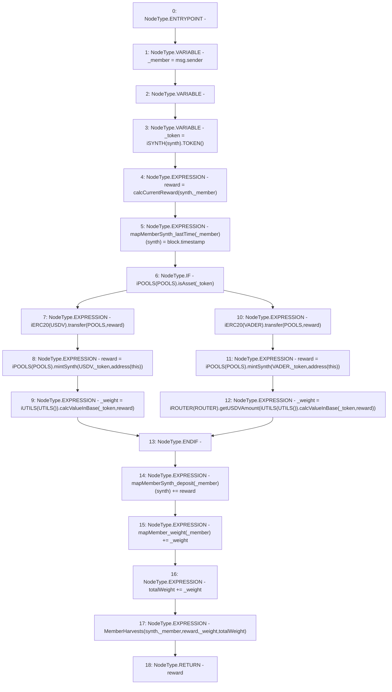

# Context: Vault.harvest

**Contract:** `Vault` (Inherits: None)
**Signature:** `harvest(address) returns (uint256)`
**Method Selector ID:** `0x0e5c011e`
**Visibility:** `external`
**Environment-Free:** `No (reads EVM state context)`
**Modifiers:** None

### State Variables Interaction
- **Reads:** POOLS, ROUTER, USDV, VADER, mapMemberSynth_deposit, mapMember_weight, totalWeight
- **Writes:** mapMemberSynth_deposit, mapMemberSynth_lastTime, mapMember_weight, totalWeight

### Environment & Verification Flags
- **Uses Foundry Cheatcodes:** No
- **Has Echidna Properties:** No

### Internal Calls Tree
- None

### External Calls / Value Transfers
- `iPOOLS.TMP_1222(bool) = HIGH_LEVEL_CALL, dest:TMP_1221(iPOOLS), function:isAsset, arguments:['_token']  `
- `iROUTER.TMP_1240(uint256) = HIGH_LEVEL_CALL, dest:TMP_1236(iROUTER), function:getUSDVAmount, arguments:['TMP_1239']  `
- `iPOOLS.TMP_1235(uint256) = HIGH_LEVEL_CALL, dest:TMP_1233(iPOOLS), function:mintSynth, arguments:['VADER', '_token', 'TMP_1234']  `
- `iUTILS.TMP_1230(uint256) = HIGH_LEVEL_CALL, dest:TMP_1229(iUTILS), function:calcValueInBase, arguments:['_token', 'reward']  `
- `iERC20.TMP_1232(bool) = HIGH_LEVEL_CALL, dest:TMP_1231(iERC20), function:transfer, arguments:['POOLS', 'reward']  `
- `iERC20.TMP_1224(bool) = HIGH_LEVEL_CALL, dest:TMP_1223(iERC20), function:transfer, arguments:['POOLS', 'reward']  `
- `iPOOLS.TMP_1227(uint256) = HIGH_LEVEL_CALL, dest:TMP_1225(iPOOLS), function:mintSynth, arguments:['USDV', '_token', 'TMP_1226']  `
- `iUTILS.TMP_1239(uint256) = HIGH_LEVEL_CALL, dest:TMP_1238(iUTILS), function:calcValueInBase, arguments:['_token', 'reward']  `
- `iSYNTH.TMP_1219(address) = HIGH_LEVEL_CALL, dest:TMP_1218(iSYNTH), function:TOKEN, arguments:[]  `

### Control Flow Graph (CFG)


### Source Mapping
Declared in: `contracts/Vault.sol` on lines **101** to **120**

```solidity
    function harvest(address synth) external returns(uint reward) {
        address _member = msg.sender;
        uint _weight;
        address _token = iSYNTH(synth).TOKEN();
        reward = calcCurrentReward(synth, _member);                     // In USDV
        mapMemberSynth_lastTime[_member][synth] = block.timestamp;      // Reset time
        if(iPOOLS(POOLS).isAsset(_token)){
            iERC20(USDV).transfer(POOLS, reward); 
            reward = iPOOLS(POOLS).mintSynth(USDV, _token, address(this));
            _weight = iUTILS(UTILS()).calcValueInBase(_token, reward);
        } else {
            iERC20(VADER).transfer(POOLS, reward); 
            reward = iPOOLS(POOLS).mintSynth(VADER, _token, address(this));
            _weight = iROUTER(ROUTER).getUSDVAmount(iUTILS(UTILS()).calcValueInBase(_token, reward));
        }
        mapMemberSynth_deposit[_member][synth] += reward; 
        mapMember_weight[_member] += _weight;
        totalWeight += _weight;
        emit MemberHarvests(synth, _member, reward, _weight, totalWeight);
    }

```
