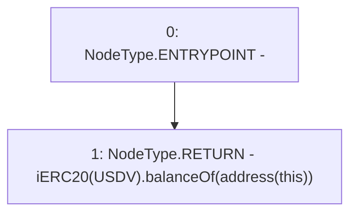

# Context: Vault.reserveUSDV

**Contract:** `Vault` (Inherits: None)
**Signature:** `reserveUSDV() returns (uint256)`
**Method Selector ID:** `0xde6ad44e`
**Visibility:** `public`
**Environment-Free:** `Yes`
**Modifiers:** None

### State Variables Interaction
- **Reads:** USDV
- **Writes:** None

### Environment & Verification Flags
- **Uses Foundry Cheatcodes:** No
- **Has Echidna Properties:** No

### Internal Calls Tree
- None

### External Calls / Value Transfers
- `iERC20.TMP_1303(uint256) = HIGH_LEVEL_CALL, dest:TMP_1301(iERC20), function:balanceOf, arguments:['TMP_1302']  `

### Control Flow Graph (CFG)


### Source Mapping
Declared in: `contracts/Vault.sol` on lines **181** to **183**

```solidity
    function reserveUSDV() public view returns(uint) {
        return iERC20(USDV).balanceOf(address(this)); // Balance
    }

```
