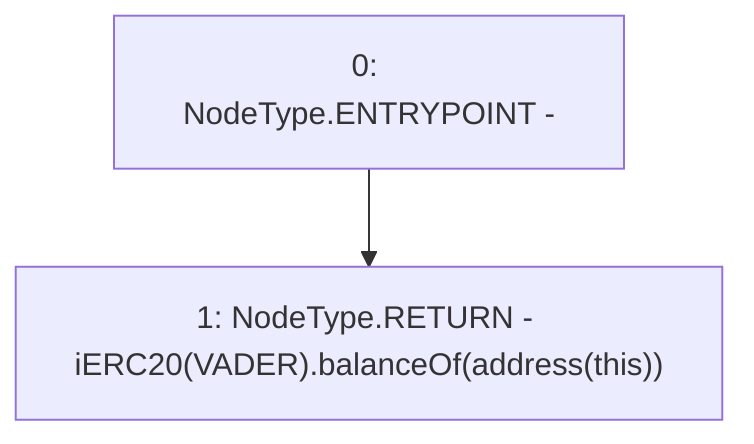

# Context: Vault.reserveVADER

**Contract:** `Vault` (Inherits: None)
**Signature:** `reserveVADER() returns (uint256)`
**Method Selector ID:** `0x62cea340`
**Visibility:** `public`
**Environment-Free:** `Yes`
**Modifiers:** None

### State Variables Interaction
- **Reads:** VADER
- **Writes:** None

### Environment & Verification Flags
- **Uses Foundry Cheatcodes:** No
- **Has Echidna Properties:** No

### Internal Calls Tree
- None

### External Calls / Value Transfers
- `iERC20.TMP_1306(uint256) = HIGH_LEVEL_CALL, dest:TMP_1304(iERC20), function:balanceOf, arguments:['TMP_1305']  `

### Control Flow Graph (CFG)


### Source Mapping
Declared in: `contracts/Vault.sol` on lines **184** to **186**

```solidity
    function reserveVADER() public view returns(uint) {
        return iERC20(VADER).balanceOf(address(this)); // Balance
    }

```
