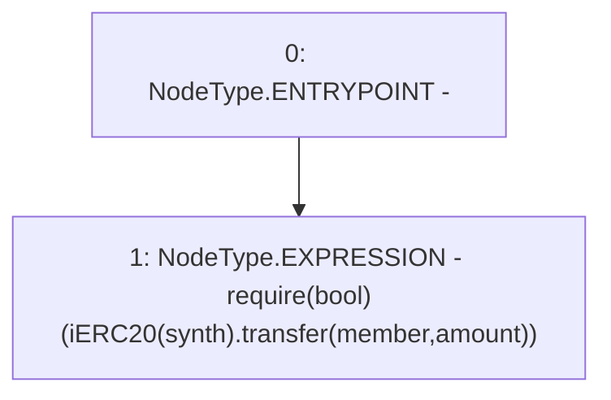

# Context: Vault.sendFunds

**Contract:** `Vault` (Inherits: None)
**Signature:** `sendFunds(address,address,uint256)`
**Method Selector ID:** `Internal (No Method ID)`
**Visibility:** `internal`
**Environment-Free:** `Yes`
**Modifiers:** None

### State Variables Interaction
- **Reads:** None
- **Writes:** None

### Assertion Checks & Business Requirements
- require/assert: `require(bool)(iERC20(synth).transfer(member,amount))`

### Environment & Verification Flags
- **Uses Foundry Cheatcodes:** No
- **Has Echidna Properties:** No

### Internal Calls Tree
- None

### External Calls / Value Transfers
- `iERC20.TMP_1299(bool) = HIGH_LEVEL_CALL, dest:TMP_1298(iERC20), function:transfer, arguments:['member', 'amount']  `

### Control Flow Graph (CFG)


### Source Mapping
Declared in: `contracts/Vault.sol` on lines **175** to **177**

```solidity
    function sendFunds(address synth, address member, uint amount) internal {
        require(iERC20(synth).transfer(member, amount));
    }

```
