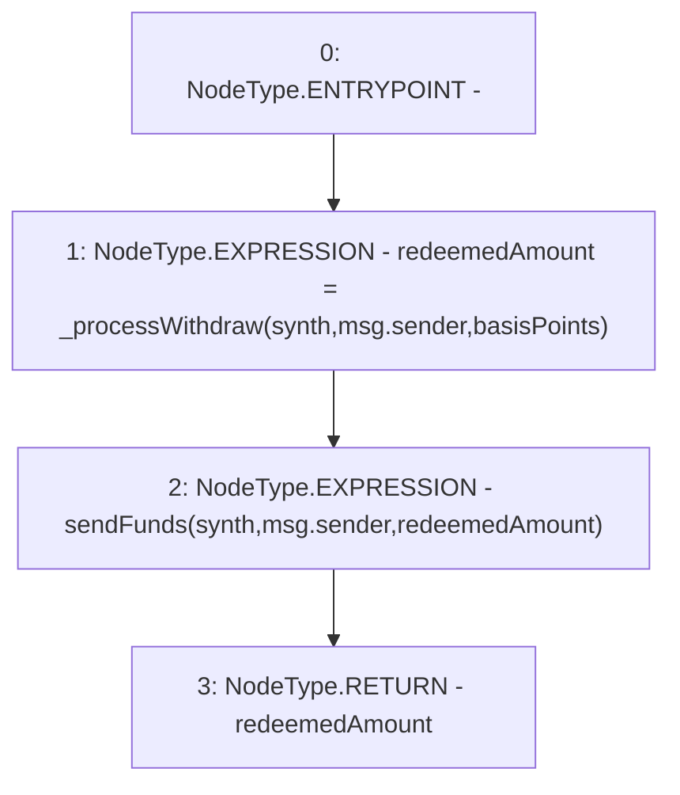

# Context: Vault.withdraw

**Contract:** `Vault` (Inherits: None)
**Signature:** `withdraw(address,uint256) returns (uint256)`
**Method Selector ID:** `0xf3fef3a3`
**Visibility:** `external`
**Environment-Free:** `No (reads EVM state context)`
**Modifiers:** None

### State Variables Interaction
- **Reads:** None
- **Writes:** None

### Environment & Verification Flags
- **Uses Foundry Cheatcodes:** No
- **Has Echidna Properties:** No

### Internal Calls Tree
- None

### External Calls / Value Transfers
- None

### Control Flow Graph (CFG)


### Source Mapping
Declared in: `contracts/Vault.sol` on lines **152** to **155**

```solidity
    function withdraw(address synth, uint basisPoints) external returns(uint redeemedAmount) {
        redeemedAmount = _processWithdraw(synth, msg.sender, basisPoints);          // Get amount to withdraw
        sendFunds(synth, msg.sender, redeemedAmount);
    }

```
