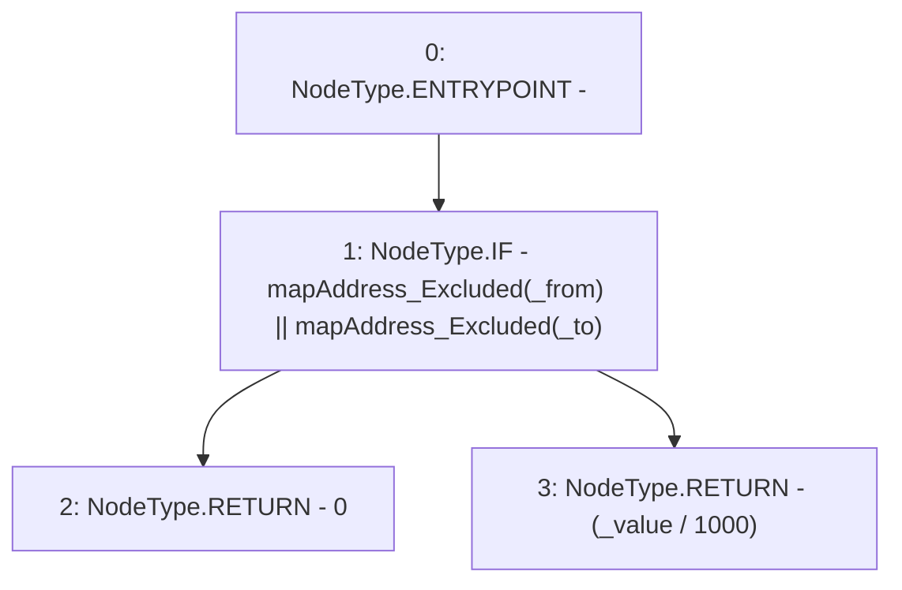

# Context: Vether._getFee

**Contract:** `Vether` (Inherits: iVETHER)
**Signature:** `_getFee(address,address,uint256) returns (uint256)`
**Method Selector ID:** `Internal (No Method ID)`
**Visibility:** `private`
**Environment-Free:** `Yes`
**Modifiers:** None

### State Variables Interaction
- **Reads:** mapAddress_Excluded
- **Writes:** None

### Environment & Verification Flags
- **Uses Foundry Cheatcodes:** No
- **Has Echidna Properties:** No

### Internal Calls Tree
- None

### External Calls / Value Transfers
- None

### Control Flow Graph (CFG)


### Source Mapping
Declared in: `contracts/Vether.sol` on lines **85** to **91**

```solidity
    function _getFee(address _from, address _to, uint _value) private view returns (uint) {
        if (mapAddress_Excluded[_from] || mapAddress_Excluded[_to]) {
           return 0;                                                                        // No fee if excluded
        } else {
            return (_value / 1000);                                                         // Fee amount = 0.1%
        }
    }

```
