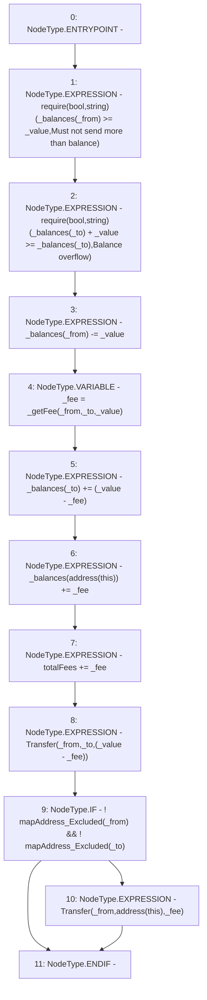

# Context: Vether._transfer

**Contract:** `Vether` (Inherits: iVETHER)
**Signature:** `_transfer(address,address,uint256)`
**Method Selector ID:** `Internal (No Method ID)`
**Visibility:** `private`
**Environment-Free:** `Yes`
**Modifiers:** None

### State Variables Interaction
- **Reads:** _balances, mapAddress_Excluded, totalFees
- **Writes:** _balances, totalFees

### Assertion Checks & Business Requirements
- require/assert: `require(bool,string)(_balances[_from] >= _value,Must not send more than balance)`
- require/assert: `require(bool,string)(_balances[_to] + _value >= _balances[_to],Balance overflow)`

### Environment & Verification Flags
- **Uses Foundry Cheatcodes:** No
- **Has Echidna Properties:** No

### Internal Calls Tree
- None

### External Calls / Value Transfers
- `TMP_1333(None) = SOLIDITY_CALL require(bool,string)(TMP_1332,Must not send more than balance)`

### Control Flow Graph (CFG)


### Source Mapping
Declared in: `contracts/Vether.sol` on lines **70** to **82**

```solidity
    function _transfer(address _from, address _to, uint _value) private {
        require(_balances[_from] >= _value, 'Must not send more than balance');
        require(_balances[_to] + _value >= _balances[_to], 'Balance overflow');
        _balances[_from] -= _value;
        uint _fee = _getFee(_from, _to, _value);                                            // Get fee amount
        _balances[_to] += (_value - _fee);                                               // Add to receiver
        _balances[address(this)] += _fee;                                                   // Add fee to self
        totalFees += _fee;                                                                  // Track fees collected
        emit Transfer(_from, _to, (_value - _fee));                                      // Transfer event
        if (!mapAddress_Excluded[_from] && !mapAddress_Excluded[_to]) {
            emit Transfer(_from, address(this), _fee);                                      // Fee Transfer event
        }
    }

```
