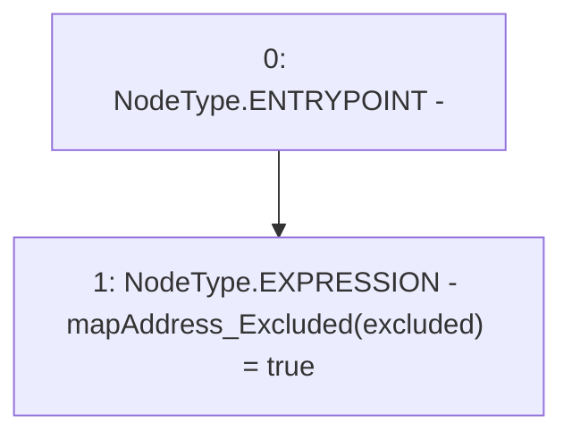

# Context: Vether.addExcluded

**Contract:** `Vether` (Inherits: iVETHER)
**Signature:** `addExcluded(address)`
**Method Selector ID:** `0xa9321573`
**Visibility:** `public`
**Environment-Free:** `Yes`
**Modifiers:** None

### State Variables Interaction
- **Reads:** None
- **Writes:** mapAddress_Excluded

### Environment & Verification Flags
- **Uses Foundry Cheatcodes:** No
- **Has Echidna Properties:** No

### Internal Calls Tree
- None

### External Calls / Value Transfers
- None

### Control Flow Graph (CFG)


### Source Mapping
Declared in: `contracts/Vether.sol` on lines **93** to **95**

```solidity
    function addExcluded(address excluded) public {
        mapAddress_Excluded[excluded] = true;
    }

```
