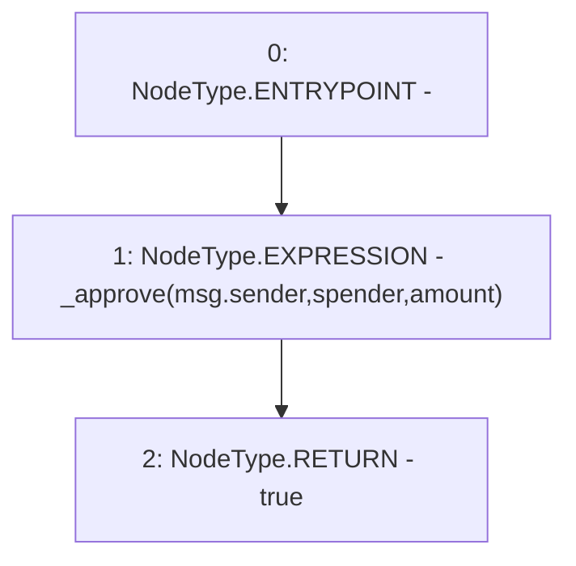

# Context: Vether.approve

**Contract:** `Vether` (Inherits: iVETHER)
**Signature:** `approve(address,uint256) returns (bool)`
**Method Selector ID:** `0x095ea7b3`
**Visibility:** `public`
**Environment-Free:** `No (reads EVM state context)`
**Modifiers:** None

### State Variables Interaction
- **Reads:** None
- **Writes:** None

### Environment & Verification Flags
- **Uses Foundry Cheatcodes:** No
- **Has Echidna Properties:** No

### Internal Calls Tree
- None

### External Calls / Value Transfers
- None

### Control Flow Graph (CFG)


### Source Mapping
Declared in: `contracts/Vether.sol` on lines **43** to **46**

```solidity
    function approve(address spender, uint amount) public virtual override returns (bool) {
        _approve(msg.sender, spender, amount);
        return true;
    }

```
