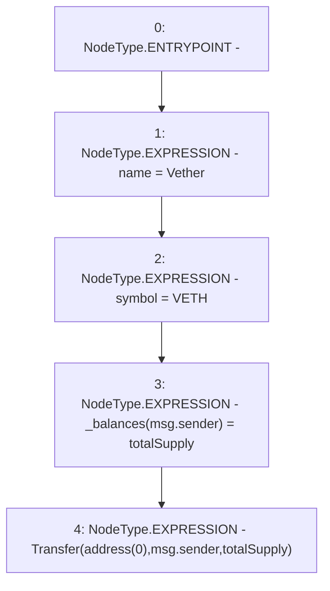

# Context: Vether.constructor

**Contract:** `Vether` (Inherits: iVETHER)
**Signature:** `constructor()`
**Method Selector ID:** `0x90fa17bb`
**Visibility:** `public`
**Environment-Free:** `No (reads EVM state context)`
**Modifiers:** None

### State Variables Interaction
- **Reads:** totalSupply
- **Writes:** _balances, name, symbol

### Environment & Verification Flags
- **Uses Foundry Cheatcodes:** No
- **Has Echidna Properties:** No

### Internal Calls Tree
- None

### External Calls / Value Transfers
- None

### Control Flow Graph (CFG)


### Source Mapping
Declared in: `contracts/Vether.sol` on lines **24** to **29**

```solidity
    constructor() {
        name = "Vether";
        symbol  = "VETH";
        _balances[msg.sender] = totalSupply;
        emit Transfer(address(0), msg.sender, totalSupply);
    }

```
