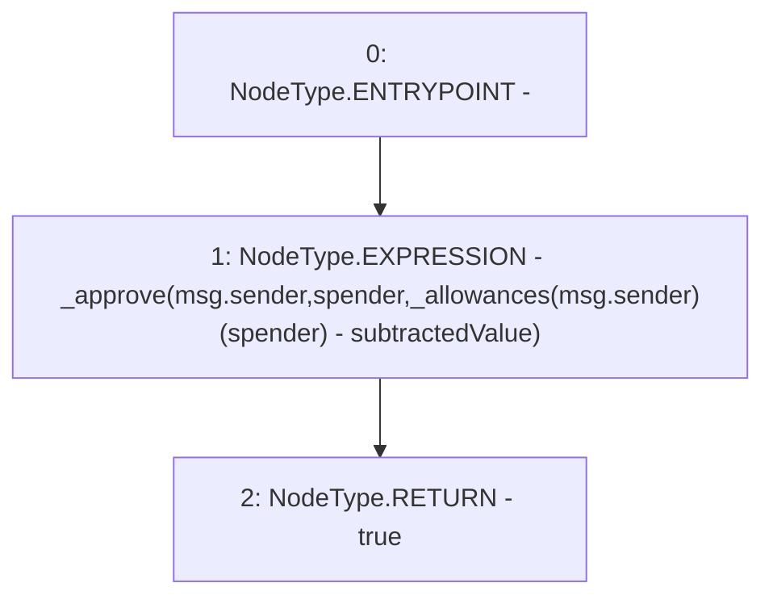

# Context: Vether.decreaseAllowance

**Contract:** `Vether` (Inherits: iVETHER)
**Signature:** `decreaseAllowance(address,uint256) returns (bool)`
**Method Selector ID:** `0xa457c2d7`
**Visibility:** `public`
**Environment-Free:** `No (reads EVM state context)`
**Modifiers:** None

### State Variables Interaction
- **Reads:** _allowances
- **Writes:** None

### Environment & Verification Flags
- **Uses Foundry Cheatcodes:** No
- **Has Echidna Properties:** No

### Internal Calls Tree
- None

### External Calls / Value Transfers
- None

### Control Flow Graph (CFG)


### Source Mapping
Declared in: `contracts/Vether.sol` on lines **51** to **54**

```solidity
    function decreaseAllowance(address spender, uint subtractedValue) public virtual returns (bool) {
        _approve(msg.sender, spender, _allowances[msg.sender][spender] - subtractedValue);
        return true;
    }

```
