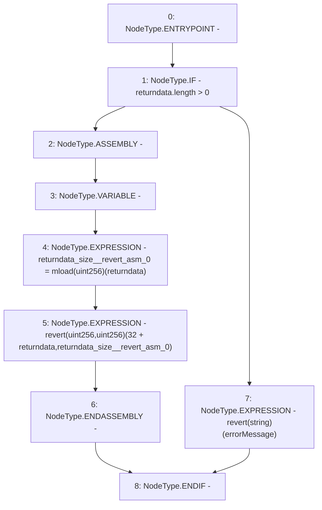

# Context: Address._revert

**Contract:** `Address` (Inherits: None)
**Signature:** `_revert(bytes,string)`
**Method Selector ID:** `Internal (No Method ID)`
**Visibility:** `private`
**Environment-Free:** `Yes`
**Modifiers:** None

### State Variables Interaction
- **Reads:** None
- **Writes:** None

### Assertion Checks & Business Requirements
- revert: `returndata_size__revert_asm_0 = mload(uint256)(returndata)`
- revert: `revert(uint256,uint256)(32 + returndata,returndata_size__revert_asm_0)`
- revert: `revert(string)(errorMessage)`

### Environment & Verification Flags
- **Uses Foundry Cheatcodes:** No
- **Has Echidna Properties:** No

### Internal Calls Tree
- None

### External Calls / Value Transfers
- None

### Control Flow Graph (CFG)


### Source Mapping
Declared in: `certora-ac-datasets/detasets/web3bugs/dataset/web3bugs/52/node_modules/@openzeppelin/contracts/utils/Address.sol` on lines **231** to **243**

```solidity
    function _revert(bytes memory returndata, string memory errorMessage) private pure {
        // Look for revert reason and bubble it up if present
        if (returndata.length > 0) {
            // The easiest way to bubble the revert reason is using memory via assembly
            /// @solidity memory-safe-assembly
            assembly {
                let returndata_size := mload(returndata)
                revert(add(32, returndata), returndata_size)
            }
        } else {
            revert(errorMessage);
        }
    }

```
