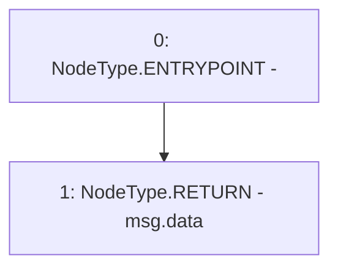

# Context: BasePoolV2._msgData

**Contract:** `BasePoolV2` (Inherits: ReentrancyGuard, ERC721, IERC721Metadata, IERC721, ERC165, IERC165, Context, GasThrottle, ProtocolConstants, IBasePoolV2)
**Signature:** `_msgData() returns (bytes)`
**Method Selector ID:** `Internal (No Method ID)`
**Visibility:** `internal`
**Environment-Free:** `No (reads EVM state context)`
**Modifiers:** None

### State Variables Interaction
- **Reads:** None
- **Writes:** None

### Environment & Verification Flags
- **Uses Foundry Cheatcodes:** No
- **Has Echidna Properties:** No

### Internal Calls Tree
- None

### External Calls / Value Transfers
- None

### Control Flow Graph (CFG)


### Source Mapping
Declared in: `certora-ac-datasets/detasets/web3bugs/dataset/web3bugs/52/node_modules/@openzeppelin/contracts/utils/Context.sol` on lines **21** to **23**

```solidity
    function _msgData() internal view virtual returns (bytes calldata) {
        return msg.data;
    }

```
