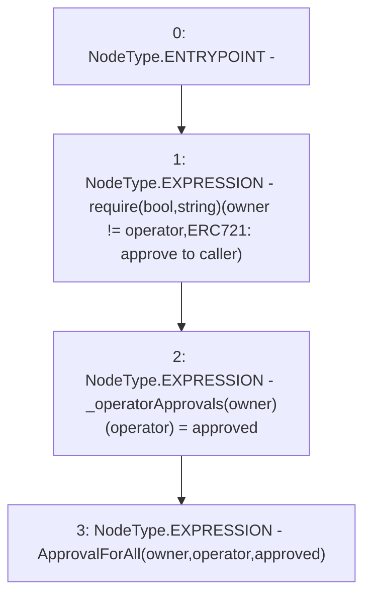

# Context: BasePoolV2._setApprovalForAll

**Contract:** `BasePoolV2` (Inherits: ReentrancyGuard, ERC721, IERC721Metadata, IERC721, ERC165, IERC165, Context, GasThrottle, ProtocolConstants, IBasePoolV2)
**Signature:** `_setApprovalForAll(address,address,bool)`
**Method Selector ID:** `Internal (No Method ID)`
**Visibility:** `internal`
**Environment-Free:** `Yes`
**Modifiers:** None

### State Variables Interaction
- **Reads:** None
- **Writes:** _operatorApprovals

### Assertion Checks & Business Requirements
- require/assert: `require(bool,string)(owner != operator,ERC721: approve to caller)`

### Environment & Verification Flags
- **Uses Foundry Cheatcodes:** No
- **Has Echidna Properties:** No

### Internal Calls Tree
- None

### External Calls / Value Transfers
- None

### Control Flow Graph (CFG)


### Source Mapping
Declared in: `certora-ac-datasets/detasets/web3bugs/dataset/web3bugs/52/node_modules/@openzeppelin/contracts/token/ERC721/ERC721.sol` on lines **376** to **380**

```solidity
    function _setApprovalForAll(address owner, address operator, bool approved) internal virtual {
        require(owner != operator, "ERC721: approve to caller");
        _operatorApprovals[owner][operator] = approved;
        emit ApprovalForAll(owner, operator, approved);
    }

```
