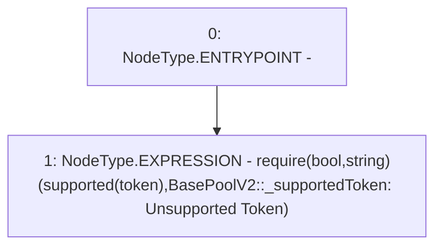

# Context: BasePoolV2._supportedToken

**Contract:** `BasePoolV2` (Inherits: ReentrancyGuard, ERC721, IERC721Metadata, IERC721, ERC165, IERC165, Context, GasThrottle, ProtocolConstants, IBasePoolV2)
**Signature:** `_supportedToken(IERC20)`
**Method Selector ID:** `Internal (No Method ID)`
**Visibility:** `private`
**Environment-Free:** `Yes`
**Modifiers:** None

### State Variables Interaction
- **Reads:** supported
- **Writes:** None

### Assertion Checks & Business Requirements
- require/assert: `require(bool,string)(supported[token],BasePoolV2::_supportedToken: Unsupported Token)`

### Environment & Verification Flags
- **Uses Foundry Cheatcodes:** No
- **Has Echidna Properties:** No

### Internal Calls Tree
- None

### External Calls / Value Transfers
- None

### Control Flow Graph (CFG)


### Source Mapping
Declared in: `certora-ac-datasets/detasets/web3bugs/dataset/web3bugs/52/contracts/dex-v2/pool/BasePoolV2.sol` on lines **575** to **580**

```solidity
    function _supportedToken(IERC20 token) private view {
        require(
            supported[token],
            "BasePoolV2::_supportedToken: Unsupported Token"
        );
    }

```
